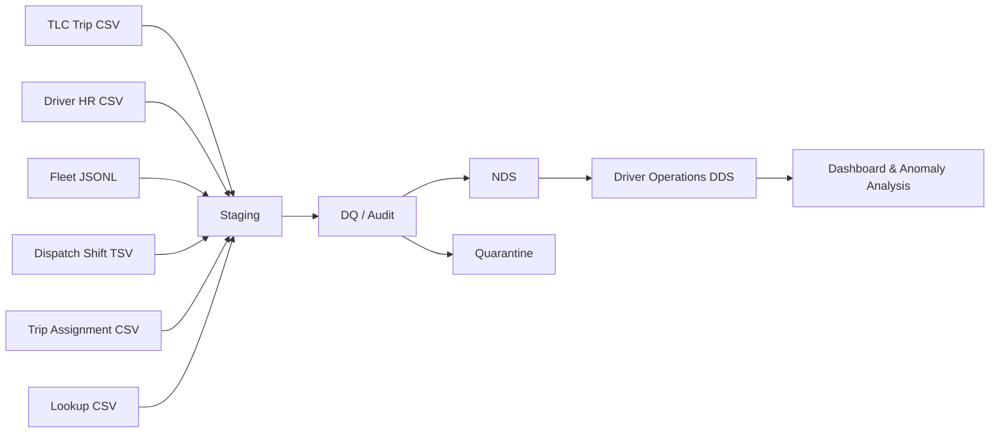

<div align="center">

# NYC Green Taxi Driver Operations BI


**Kho dữ liệu phân tích hiệu quả vận hành tài xế và đội xe từ NYC Green Taxi trip records.**

[Tổng quan](#tổng-quan) · [Kiến trúc](#kiến-trúc) · [Bắt đầu nhanh](#bắt-đầu-nhanh) · [Tài liệu](#tài-liệu) · [Lộ trình](#lộ-trình)

</div>

> Dự án tích hợp dữ liệu chuyến đi TLC với các nguồn vận hành mô phỏng gồm
> Driver HR, Fleet, Dispatch và Trip Assignment để xây dựng Driver Operations
> Data Delivery Store phục vụ quản lý đội xe và tài xế.

## Tổng quan

Đây là repository của đồ án môn **Ứng dụng trí tuệ kinh doanh nâng cao**. Phạm
vi tập trung vào năm nhóm câu hỏi vận hành: hiệu suất tài xế, hiệu quả ca làm,
mức sử dụng phương tiện, hiệu quả theo khu vực/thời gian và chất lượng dữ liệu.

| Hạng mục | Nội dung |
|---|---|
| Người dùng cuối | Quản lý vận hành đội xe và tài xế |
| Dữ liệu nền | NYC TLC Green Taxi trip records |
| Nguồn bổ sung | Driver HR, Fleet, Dispatch Shift, Trip Assignment |
| Kiến trúc | `Staging -> DQ/Audit -> NDS -> DDS` |
| Nhịp xử lý | Batch theo tháng cho dữ liệu lịch sử |
| Trạng thái | Milestone 1 hoàn tất; Staging và các tầng sau đang trong lộ trình |

## Điểm nổi bật

| Khả năng | Mô tả |
|---|---|
| Synthetic operational sources | Sinh dữ liệu Driver HR, Fleet, Dispatch và Assignment có thể tái lập bằng seed |
| Data contracts | Định nghĩa schema, khóa, định dạng và quy tắc cho từng nguồn |
| Data quality | Kiểm tra schema, tham chiếu, thời gian, duplicate và record cần quarantine |
| Auditability | Manifest, SHA-256 checksum, batch metadata và row-level traceability |
| Warehouse design | Thiết kế NDS tích hợp và Driver Operations DDS dạng star schema |
| Analytics plan | KPI cho trip, ca làm, utilization, revenue và business anomaly |

## Kiến trúc



Dự án không sử dụng ODS vì xử lý dữ liệu lịch sử theo batch và không có yêu
cầu operational view gần thời gian thực. NDS chịu trách nhiệm tích hợp, chuẩn
hóa và lưu lịch sử; DDS tối ưu dữ liệu cho phân tích Driver Operations.

## Bắt đầu nhanh

### Yêu cầu

- Git
- Python 3.11 trở lên

### Clone và kiểm thử

```powershell
git clone https://github.com/HuyVuCV1011/Green-taxi.git
cd Green-taxi
python -m unittest discover -s tests -v
```

Test hiện tại sử dụng dữ liệu nhỏ trong `data/sample/`, không cần tải full data
hay cài PostgreSQL.

### Sinh và kiểm tra dữ liệu synthetic

Khi đã đặt TLC source data theo
[hướng dẫn onboarding](docs/13-team-onboarding-and-data-setup.md):

```powershell
python scripts/generate_synthetic_sources.py
python scripts/validate_synthetic_sources.py
python scripts/create_repository_samples.py
```

Generator sử dụng cấu hình `configs/synthetic_generation.json`. Raw output được
ghi vào `data/raw/synthetic/` và không được commit; manifest cùng báo cáo kiểm
tra được lưu trong `data/metadata/`.

## Công nghệ

| Tầng | Công nghệ / định dạng |
|---|---|
| Ingestion, generation, DQ | Python |
| Transformation, reconciliation | SQL |
| Staging, NDS, DDS | PostgreSQL (planned) |
| Dashboard | Power BI hoặc Apache Superset (planned) |
| Source formats | CSV, JSONL, TSV |
| Version control | GitHub |

## Cấu trúc dự án

<details>
<summary>Xem cây thư mục chính</summary>

```text
Green-taxi/
|-- configs/              # Cấu hình không chứa secret
|-- data/
|   |-- sample/           # Sample nhỏ dùng cho test
|   |-- lookup/           # Master/lookup được phép commit
|   |-- metadata/         # Manifest, checksum và validation report
|   |-- raw/              # Full/raw data local, bị Git ignore
|   |-- interim/          # Dữ liệu trung gian, bị Git ignore
|   `-- processed/        # Kết quả pipeline, bị Git ignore
|-- diagrams/             # Sơ đồ kiến trúc và mô hình
|-- docs/                 # Scope, thiết kế, ADR và meeting notes
|-- notebooks/            # EDA và thử nghiệm có thể tái lập
|-- scripts/              # Generator, validator và pipeline scripts
|-- sql/                  # DDL, transformations, tests và queries
|-- src/                  # Ingestion, DQ, warehouse và analytics
|-- tests/                # Unit, integration và DQ tests
|-- deliverables/         # Reports, slides và spreadsheets
`-- archive/              # Tài liệu cũ chỉ dùng tham khảo
```

</details>

## Tài liệu

| Tài liệu | Nội dung |
|---|---|
| [Team onboarding](docs/13-team-onboarding-and-data-setup.md) | Thiết lập môi trường, sample/full data và quy trình chia sẻ |
| [Project scope](docs/03-scope.md) | Phạm vi nghiệp vụ, người dùng và câu hỏi quyết định |
| [System architecture](docs/05-architecture.md) | Staging, DQ/Audit, NDS và DDS |
| [Data sources](docs/04-data-sources.md) | Inventory và vai trò của từng nguồn |
| [Data contracts](docs/08-data-contracts.md) | Schema và quy tắc dữ liệu synthetic |
| [Source-to-target plan](docs/10-source-to-target-plan.md) | Mapping nguồn đến NDS/DDS |
| [Implementation plan](docs/07-implementation-plan.md) | Các phase triển khai và definition of done |
| [Documentation index](docs/README.md) | Danh mục tài liệu đầy đủ |

## Lộ trình

- [x] Chốt phạm vi Driver Operations và kiến trúc không ODS
- [x] Xây dựng data contracts và synthetic source package
- [x] Tạo manifest, validation và repository sample
- [ ] Xây dựng PostgreSQL staging, loaders và batch audit
- [ ] Triển khai DQ, quarantine và NDS integration
- [ ] Xây dựng Driver Operations DDS và reconciliation
- [ ] Phát triển dashboard, KPI và anomaly analysis
- [ ] Hoàn thiện báo cáo, slide, demo và reproducibility guide

Chi tiết milestone và phân công nằm trong
[Work Breakdown Structure](docs/11-work-breakdown.md).

## Quy tắc dữ liệu

- Chỉ commit sample, lookup nhỏ, metadata và tài liệu cần thiết để review/test.
- Không commit raw/full data, dữ liệu sinh ra, recording, secret hoặc file tạm.
- Full data được lưu trong kho dùng chung của nhóm hoặc tái tạo từ nguồn TLC.
- Mỗi thay đổi kiến trúc quan trọng phải được ghi bằng ADR trong
  [`docs/decisions/`](docs/decisions/).
- Kết quả EDA quan trọng phải có thể tái tạo bằng code.

## Đóng góp

1. Tạo branch theo phạm vi công việc, ví dụ `feature/staging-loader`.
2. Giữ raw data và secret ngoài Git.
3. Chạy `python -m unittest discover -s tests -v`.
4. Tạo pull request và mô tả thay đổi, dữ liệu kiểm thử cùng kết quả
   reconciliation liên quan.
