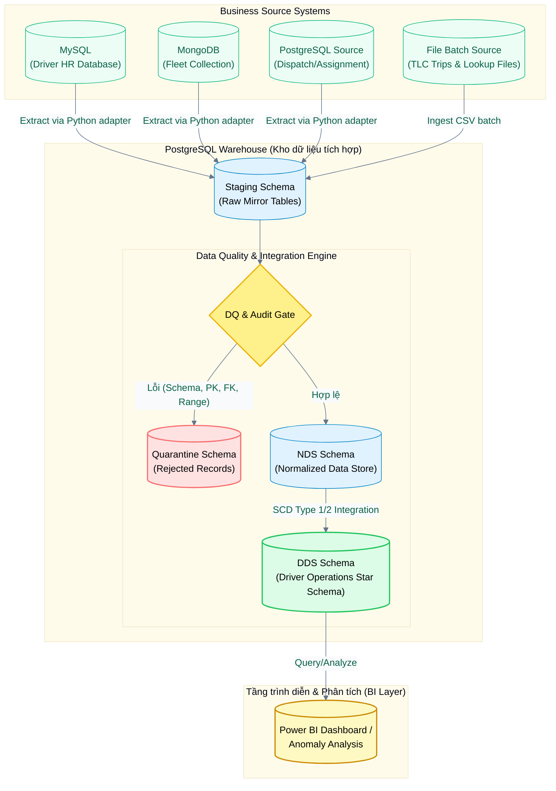
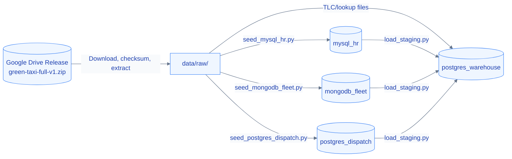

<div align="center">

# NYC Green Taxi Driver Operations BI

**Kho dữ liệu phân tích hiệu quả vận hành tài xế và đội xe từ NYC Green Taxi Trip Records**

[](https://www.python.org/)
[](https://www.docker.com/)
[](https://www.postgresql.org/)
[](https://www.mysql.com/)
[](https://www.mongodb.com/)
[](https://powerbi.microsoft.com/)
[](https://github.com/HuyVuCV1011/Green-taxi)

[Tổng quan](#tổng quan) • [Điểm nổi bật](#điểm-nổi-bật) • [Kiến trúc dữ liệu (Data Flow)](#kiến-trúc-dữ-liệu-data-flow) • [Bắt đầu nhanh (Quick Start)](#bắt-đầu-nhanh-quick-start) • [Ma trận dịch vụ Docker (Service Matrix)](#ma-trận-dịch-vụ-docker-service-matrix) • [Bản đồ tài liệu](#bản-đồ-tài-liệu) • [Lộ trình dự án (Project Roadmap)](#lộ-trình-dự-án-project-roadmap) • [Quy tắc dữ liệu (Data & Security Policy)](#quy-tắc-dữ-liệu-data--security-policy)

---
</div>

> [!NOTE]
> Đây là repository của đồ án môn **Ứng dụng trí tuệ kinh doanh nâng cao**. Dự án tập trung vào việc tích hợp dữ liệu chuyến đi thực tế từ NYC TLC Green Taxi với các nguồn vận hành mô phỏng (Driver HR, Fleet, Dispatch) để xây dựng kho dữ liệu Driver Operations phục vụ công tác quản lý tài xế và đội xe.

---

## Tổng quan

Dự án tập trung vào việc giải quyết 5 nhóm câu hỏi vận hành chính của doanh nghiệp taxi thông qua các chỉ số đo lường (KPI):
1. **Hiệu suất tài xế**: Doanh thu, số chuyến đi và năng suất làm việc.
2. **Hiệu quả ca làm**: Thời gian hoạt động, thời gian rảnh, đối soát ca.
3. **Mức sử dụng phương tiện**: Tần suất khai thác và bảo dưỡng xe.
4. **Hiệu quả theo khu vực/thời gian**: Điểm pickup/dropoff phổ biến và thời gian cao điểm.
5. **Chất lượng dữ liệu**: Quản lý bản ghi lỗi, quarantine và đối soát dữ liệu (reconciliation).

### Tóm tắt thông số dự án
*   **Dữ liệu chuyến đi (Thật):** NYC TLC Green Taxi trip records.
*   **Dữ liệu vận hành (Giả lập):** Driver HR, Fleet, Dispatch Shift, Trip Assignment.
*   **Phạm vi phân tích:** Từ tháng 01/2020 đến tháng 07/2021 (19 tháng).
*   **Kho dữ liệu đích:** PostgreSQL (`Staging -> DQ/Audit -> NDS -> DDS`).
*   **Nhịp xử lý:** Batch theo tháng đối với dữ liệu lịch sử (Không dùng ODS, streaming hay CDC).

---

## Điểm nổi bật

*   **Mô phỏng nguồn dữ liệu đa dạng:** Khởi tạo các hệ thống nguồn mô phỏng đa dạng (MySQL, MongoDB, PostgreSQL) từ một gói dữ liệu release chuẩn nhằm tái lập môi trường thực tế của doanh nghiệp.
*   **Hợp đồng dữ liệu (Data Contracts):** Thiết lập quy định chặt chẽ về schema, kiểu dữ liệu, các business key cho từng nguồn dữ liệu thô.
*   **Quản lý chất lượng dữ liệu (DQ):** Kiểm tra khóa, enum, thời gian, tham chiếu; lỗi `ERROR` được ghi audit và cách ly trước NDS.
*   **Khả năng kiểm toán (Auditability):** Sử dụng cơ chế Manifest, mã băm SHA-256 cho các gói dữ liệu và hệ thống metadata lưu vết xử lý đến từng dòng (Row-level traceability).
*   **Mô hình hóa dữ liệu kho:** Thiết kế kho dữ liệu chuẩn hóa NDS (Normalized Data Store) tích hợp và kho dữ liệu DDS (Dimensional Data Store) dạng Star Schema tối ưu hóa cho truy vấn phân tích.

---

## Kiến trúc dữ liệu (Data Flow)

Sơ đồ dưới đây là **luồng nghiệp vụ/runtime** của pipeline. Ở góc nhìn này, dữ liệu đến từ các source systems đã được seed hoặc mount sẵn: MySQL HR, MongoDB Fleet, PostgreSQL Dispatch và TLC/lookup file batch. Google Drive không xuất hiện trong sơ đồ runtime vì nó chỉ là gói phân phối để tái lập môi trường local.



> [!IMPORTANT]
> **Google Drive Release** đóng vai trò là gói phân phối dữ liệu chuẩn để đồng bộ hóa môi trường phát triển local giữa các thành viên của dự án. Nó không được coi là một hệ thống nguồn nghiệp vụ (business source system) trong mô hình vận hành của pipeline thực tế.

Luồng setup local được mô tả riêng để người mới tái lập môi trường:



---

## Bắt đầu nhanh (Quick Start)

Làm theo hướng dẫn dưới đây để thiết lập nhanh môi trường phát triển local và chuẩn bị dữ liệu.

### Điều kiện cần (Prerequisites)
*   Hệ điều hành Windows/Linux/macOS
*   **Git**
*   **Python 3.11** trở lên
*   **Docker Desktop** (hoặc Docker Engine tích hợp Docker Compose v2)

---

### Các bước thiết lập

#### Bước 1: Clone Repository & Cài đặt thư viện Python
```powershell
# Clone mã nguồn dự án
git clone https://github.com/HuyVuCV1011/Green-taxi.git
cd Green-taxi

# Cài đặt các thư viện Python cần thiết
python -m pip install -r requirements.txt
```

#### Bước 2: Khởi tạo tệp cấu hình môi trường `.env`
```powershell
# Sao chép cấu hình mẫu thành tệp cấu hình local hoạt động
Copy-Item configs\.env.example .env
```
> [!TIP]
> Bạn có thể chỉnh sửa các cổng kết nối (port) local trong tệp `.env` nếu chúng bị trùng lặp với các phần mềm khác có sẵn trên máy.

#### Bước 3: Dựng các container cơ sở dữ liệu (Docker Services)
```powershell
# Khởi chạy các container ở chế độ chạy ngầm (detached mode)
docker compose up -d

# Kiểm tra trạng thái hoạt động của các container
docker compose ps
```

#### Bước 4: Tải dữ liệu đầy đủ & Seed vào các hệ thống nguồn
Tải gói dữ liệu release `green-taxi-full-v1.zip` từ Google Drive (theo link chi tiết và mã băm SHA-256 kiểm chứng tại [Tài liệu Onboarding](docs/00-team-onboarding-and-data-setup.md)) giải nén vào thư mục `data/raw/`.

Chạy các tập lệnh seed dữ liệu thô từ thư mục giải nén vào các cơ sở dữ liệu nguồn cục bộ tương ứng:
```powershell
# Seed dữ liệu Driver HR vào MySQL
python scripts/seed_mysql_hr.py --release-id green-taxi-full-v1

# Seed dữ liệu Fleet vào MongoDB
python scripts/seed_mongodb_fleet.py --release-id green-taxi-full-v1

# Seed dữ liệu Dispatch và Trip Assignment vào PostgreSQL Source
python scripts/seed_postgres_dispatch.py --release-id green-taxi-full-v1
```

#### Bước 5: Áp dụng DDL để khởi tạo cấu trúc Kho dữ liệu PostgreSQL
```powershell
# Khởi tạo đầy đủ staging, audit, dq, NDS và DDS
python scripts/apply_warehouse_ddl.py --mode docker
```

#### Bước 6: Trích xuất và nạp dữ liệu từ các nguồn vào Staging Warehouse
```powershell
# Trích xuất và nạp toàn bộ dữ liệu từ các nguồn vào Staging
python scripts/load_staging.py --release-id green-taxi-full-v1 --source all

# DQ Gate 1 và chuẩn hóa Staging -> NDS
python scripts/load_nds.py --release-id green-taxi-full-v1

# DQ Gate 2, SCD2 và NDS -> DDS
python scripts/load_dds.py --release-id green-taxi-full-v1
```

#### Bước 7: Khởi chạy Giao diện điều khiển (Pipeline Control Panel)
```powershell
# Chạy orchestration từ CLI (mô phỏng hoặc thực chạy)
python scripts/run_pipeline.py --release-id green-taxi-full-v1 --dry-run
python scripts/run_pipeline.py --release-id green-taxi-full-v1

# Khởi chạy giao diện Streamlit để theo dõi và đối soát dữ liệu
streamlit run app/streamlit_app.py
```
> [!NOTE]
> Control Panel dùng Green Taxi light theme và có 4 tab nghiệp vụ: **Tổng quan Hệ thống**, **Vận hành Pipeline**, **Chất lượng & Đối soát** và **Khám phá Nguồn**. Auto-Demo nằm trong expander Presentation Mode của tab vận hành để tránh bấm nhầm. Power BI là công cụ BI độc lập, không được nhúng trong Streamlit.

---

### Chạy thử nghiệm với dữ liệu mẫu (Sample Mode)
Nếu bạn chỉ muốn kiểm thử nhanh logic ETL hoặc xác minh mã nguồn chạy đúng mà không cần tải gói dữ liệu đầy đủ hay thiết lập Docker, hãy chạy bộ kiểm thử sử dụng dữ liệu mẫu có sẵn trong repository:
```powershell
python -m unittest discover -s tests -v
```

---

## Ma trận dịch vụ Docker (Service Matrix)

Các dịch vụ cơ sở dữ liệu được cấu hình sẵn trong `docker-compose.yml` để mô phỏng một môi trường phân tán thực tế:

| Service | Vai trò trong hệ thống | Cổng ánh xạ (Local Port) | Tên Database | Tài khoản mặc định | Tên Volume dữ liệu local |
| :--- | :--- | :---: | :--- | :--- | :--- |
| `mysql_hr` | Hệ thống Driver HR nguồn | ``3307 -> 3306`` | `green_taxi_hr` | `green_taxi_hr_app` | `green_taxi_mysql_hr_data` |
| `mongodb_fleet` | Quản lý đội xe (Fleet) nguồn | ``27018 -> 27017`` | `green_taxi_fleet` | `green_taxi_fleet_admin` | `green_taxi_mongodb_fleet_data` |
| `postgres_dispatch` | Hệ thống Điều hành (Dispatch) nguồn | ``5433 -> 5432`` | `green_taxi_dispatch` | `green_taxi_dispatch_app` | `green_taxi_postgres_dispatch_data` |
| `postgres_warehouse` | Kho dữ liệu đích (Warehouse) | ``5434 -> 5432`` | `green_taxi_warehouse` | `green_taxi_warehouse_app` | `green_taxi_postgres_warehouse_data` |

---

## Cấu trúc dự án

<details>
<summary><b>Xem cây thư mục chính</b></summary>

```text
Green-taxi/
├── .streamlit/           # Green Taxi light theme cho Control Panel
├── app/                  # Streamlit Data Pipeline Control Panel
├── configs/              # Cấu hình môi trường an toàn, không chứa secret
├── data/
│   ├── sample/           # Bộ dữ liệu mẫu nhỏ dùng cho unit test và review nhanh
│   ├── lookup/           # Dữ liệu tra cứu chuẩn (Taxi Zone, Vendor) được phép commit
│   ├── metadata/         # Manifest, checksum và các validation report của generator
│   ├── raw/              # Chứa dữ liệu đầy đủ từ release giải nén ra (Bị Git ignore)
│   ├── interim/          # Thư mục lưu dữ liệu trung gian trong quá trình ETL (Bị Git ignore)
│   └── processed/        # Kết quả đầu ra sau khi xử lý (Bị Git ignore)
├── diagrams/             # Sơ đồ kiến trúc và mô hình dữ liệu (.drawio, Mermaid)
├── docs/                 # Scope, tài liệu kiến trúc, ADR và biên bản họp nhóm
├── notebooks/            # Các notebook phân tích EDA và thử nghiệm thuật toán
├── scripts/              # Tập lệnh sinh dữ liệu, seed nguồn và tiện ích quản trị
├── sql/                  # Tập lệnh SQL DDL, transformation, data tests và truy vấn analytics
├── src/                  # Mã nguồn Python (Ingestion, DQ, Warehouse, Analytics)
├── tests/                # Bộ kiểm thử unit test, integration và data-quality
├── deliverables/         # Báo cáo, slide thuyết trình và bảng tính phân tích bàn giao
└── archive/              # Tài liệu, code cũ được đưa vào lưu trữ (Chỉ dùng tham khảo)
```
</details>

---

## Bản đồ tài liệu

Dự án tuân thủ nguyên tắc thiết kế **docs-first** và **data-contract-first**. Dưới đây là các tài liệu thiết kế cốt lõi:

*   **[Team onboarding](docs/00-team-onboarding-and-data-setup.md):** Hướng dẫn cấu hình môi trường phát triển local, cách tải và kiểm tra dữ liệu đầy đủ.
*   **[Project scope](docs/03-scope.md):** Định nghĩa phạm vi bài toán nghiệp vụ, nhóm người dùng mục tiêu và các câu hỏi vận hành cần giải quyết.
*   **[System architecture](docs/05-architecture.md):** Bản thiết kế chi tiết kiến trúc các tầng dữ liệu từ nguồn đến DDS.
*   **[Data sources](docs/04-data-sources.md):** Danh sách chi tiết các hệ thống nguồn và đặc tính dữ liệu.
*   **[Data contracts](docs/08-data-contracts.md):** Các cam kết về schema và kiểu dữ liệu đầu vào.
*   **[Source-to-target plan](docs/10-source-to-target-plan.md):** Thiết kế ánh xạ và chuyển đổi dữ liệu từ nguồn vào NDS và DDS.
*   **[Warehouse Physical Model Specification](docs/14-warehouse-ddl.md):** DDL executable và mô hình vật lý Staging/DQ/NDS/DDS.
*   **[NDS/DDS implementation notes](docs/18-nds-dds-implementation-notes.md):** Ghi chú triển khai, tối ưu, idempotency và reconciliation.
*   **[Staging Load](docs/15-staging-load.md):** Cơ chế source adapters, row hash, audit metadata và source-to-staging reconciliation.
*   **[Pipeline Control Panel](docs/16-pipeline-control-panel.md):** Giao diện Streamlit 4 tab để giám sát health, vận hành pipeline, xem DQ/reconciliation và khám phá nguồn.
*   **[Documentation index](docs/README.md):** Danh mục tài liệu đầy đủ và gợi ý lộ trình đọc.

---

## Lộ trình dự án (Project Roadmap)

### Những phần đã hoàn thành (Milestone 1-3)
- [x] Xác định phạm vi nghiệp vụ và chốt kiến trúc dữ liệu không sử dụng ODS.
- [x] Thiết kế Data Contracts và đóng gói thư viện sinh dữ liệu mô phỏng (`scripts/generate_synthetic_sources.py`).
- [x] Tạo Manifest, validation report và tích hợp dữ liệu mẫu (sample data) vào Git phục vụ test nhanh.
- [x] Thiết lập Docker Compose cho các dịch vụ cơ sở dữ liệu nguồn và kho dữ liệu đích.
- [x] Tạo DDL executable cho PostgreSQL Staging, Audit, DQ, NDS và DDS.
- [x] Viết tập lệnh seed dữ liệu idempotent cho MySQL HR, MongoDB Fleet và PostgreSQL Dispatch.
- [x] Xây dựng adapters trích xuất dữ liệu từ các nguồn (MySQL, MongoDB, PostgreSQL) và tệp thô vào staging.
- [x] Triển khai DQ Gate 1, quarantine, NDS 3NF và lineage theo batch/release.
- [x] Triển khai DDS, SCD2, degenerate `shift_id` và fact upsert idempotent.
- [x] Triển khai `PipelineRunner`, CLI orchestration và Streamlit Control Panel.

### Lộ trình tiếp theo (Milestone 4+)
- [ ] Chạy full pipeline smoke test trên môi trường sạch và lưu reconciliation/idempotency report.
- [ ] Thiết kế và xây dựng Dashboard phân tích hiệu suất và phát hiện các điểm bất thường vận hành (Anomaly Analysis).
- [ ] Hoàn thiện báo cáo học thuật, slide báo cáo và tài liệu hướng dẫn tái lập kết quả.

---

## Quy tắc dữ liệu (Data & Security Policy)

1.  **Tính bất biến của dữ liệu thô (Raw Data Immutability):** Dữ liệu thô sau khi được tải từ Google Drive là bất biến. Thành viên không được phép tự sửa đổi tệp tin nguồn để vượt qua lỗi của pipeline.
2.  **Không commit dữ liệu lớn và bí mật:** Nghiêm cấm commit dữ liệu thô, dữ liệu trung gian có dung lượng lớn, database volume, tệp cấu hình `.env` hoặc các khoá bảo mật lên Git. Mọi tệp tin này đã được cấu hình loại trừ qua `.gitignore`.
3.  **Tính nhất quán thời gian:** Tất cả mốc thời gian nghiệp vụ được quy ước theo múi giờ New York (`America/New_York`). Mốc thời gian kiểm toán hệ thống (Audit) được ghi nhận theo chuẩn giờ quốc tế UTC.
4.  **Idempotent Processes:** Mọi tiến trình từ Seeding đến ETL trong kho dữ liệu phải bảo đảm tính idempotent (chạy lại cùng một lô dữ liệu nhiều lần không tạo ra bản ghi trùng lặp hoặc làm thay đổi kết quả).
5.  **Ghi nhật ký quyết định (ADR):** Mọi thay đổi kiến trúc quan trọng phải được đề xuất và ghi nhận lại dưới dạng Architecture Decision Record tại [`docs/decisions/`](docs/decisions/).
6.  **Kết quả phân tích có tính tái lập:** Các kết quả EDA và báo cáo kỹ thuật quan trọng phải đảm bảo có thể tái lập thông qua mã nguồn được cung cấp.

---

## Đóng góp

1.  Tạo branch theo phạm vi công việc, ví dụ `feature/staging-loader`.
2.  Giữ raw data và secret ngoài Git.
3.  Chạy `python -m unittest discover -s tests -v`.
4.  Tạo pull request và mô tả thay đổi, dữ liệu kiểm thử cùng kết quả reconciliation liên quan.
