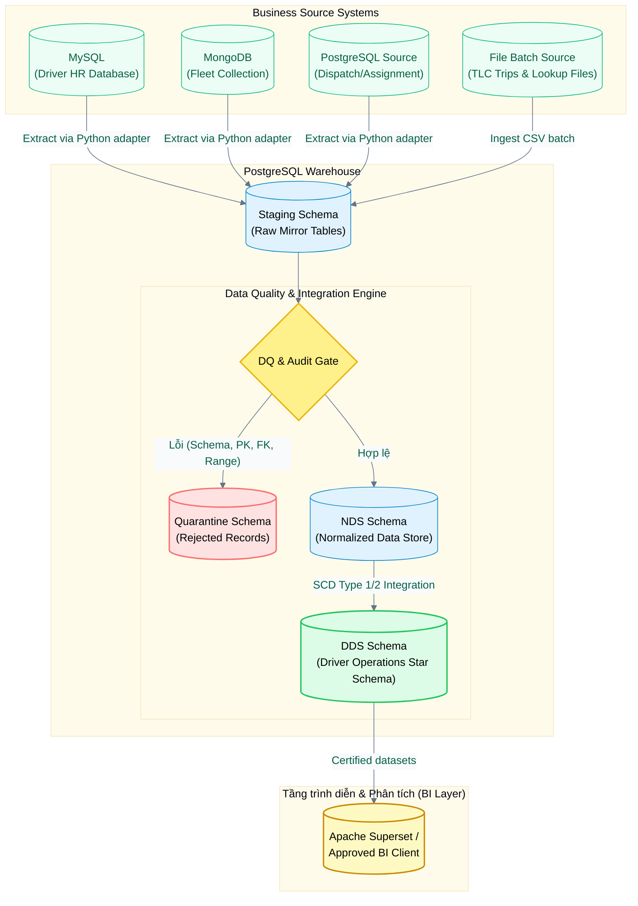
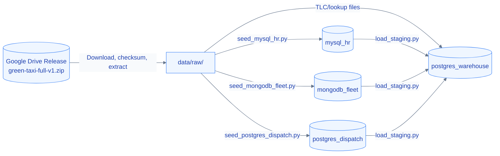

<div align="center">

# NYC Green Taxi Driver Operations BI

**Driver Operations Data Warehouse for NYC Green Taxi trip records**

[](https://www.python.org/)
[](https://www.docker.com/)
[](https://www.postgresql.org/)
[](https://www.mysql.com/)
[](https://www.mongodb.com/)
[](https://superset.apache.org/)
[](https://streamlit.io/)

**[Setup](docs/setup/local-reproducibility.md)** ·
**[Architecture](docs/architecture/system-architecture.md)** ·
**[Contracts](docs/contracts/source-data-contracts.md)** ·
**[Metrics](docs/analytics/metric-catalog.md)** ·
**[Superset Demo](docs/analytics/superset-local-demo-runbook.md)** ·
**[Evidence](docs/evidence/integration-review.md)**

---
</div>

> [!NOTE]
> Đây là repository của đồ án môn **Ứng dụng trí tuệ kinh doanh nâng cao**. Dự án tập trung vào việc tích hợp dữ liệu chuyến đi thực tế từ NYC TLC Green Taxi với các nguồn vận hành mô phỏng (Driver HR, Fleet, Dispatch) để xây dựng kho dữ liệu Driver Operations phục vụ công tác quản lý tài xế và đội xe.

---

## Mục lục

| Section | Nội dung |
|---|---|
| [Tổng quan](#overview) | Bài toán, dữ liệu, phạm vi và KPI chính |
| [Điểm nổi bật](#highlights) | Những phần đã triển khai và giá trị kỹ thuật |
| [Tech stack](#tech-stack) | Công cụ, database, BI và testing |
| [Kiến trúc dữ liệu](#data-flow) | Runtime flow và local setup flow |
| [Quick Start](#quick-start) | Lệnh reproduce môi trường local |
| [Docker services](#docker-services) | Ma trận service nguồn và warehouse |
| [Documentation](#documentation) | Source-of-truth docs theo chủ đề |
| [Roadmap](#roadmap) | Trạng thái milestone hiện tại |
| [Data policy](#data-policy) | Data, secret và reproducibility rules |

---

<a id="overview"></a>

## Tổng quan

Dự án xây dựng **data warehouse** phục vụ quản lý driver operations của Green Taxi. Dữ liệu
TLC trip records được tích hợp với nguồn vận hành mô phỏng gồm Driver HR, Fleet,
Dispatch Shift và Trip Assignment để trả lời 5 nhóm câu hỏi nghiệp vụ.

| Nhóm câu hỏi | Trọng tâm phân tích |
|---|---|
| Hiệu suất tài xế | Doanh thu, số chuyến, năng suất và peer comparison |
| Hiệu quả ca làm | Occupied/idle minutes, utilization và shift reconciliation |
| Mức sử dụng phương tiện | Tần suất khai thác, trạng thái xe và phân bổ vendor |
| Khu vực/thời gian | Pickup/dropoff zone, giờ cao điểm và phân bố hoạt động |
| Chất lượng dữ liệu | DQ issue, quarantine, anomaly và reconciliation |

| Thuộc tính | Giá trị |
|---|---|
| Trip data | NYC TLC Green Taxi trip records |
| Operational data | Synthetic Driver HR, Fleet, Dispatch Shift, Trip Assignment |
| Time range | 01/2020 đến 07/2021, 19 tháng |
| Warehouse target | PostgreSQL `Staging -> DQ/Audit -> NDS -> DDS` |
| Processing mode | Historical monthly batch; không dùng ODS, streaming hoặc CDC |
| BI layer | Approved analytics views + Apache Superset local demo |

---

<a id="highlights"></a>

## Điểm nổi bật

| Năng lực | Mô tả |
|---|---|
| Heterogeneous source simulation | MySQL HR, MongoDB Fleet, PostgreSQL Dispatch và file batch TLC/lookup |
| Data contracts | Schema, enum, key, temporal semantics và release integrity được version-control |
| DQ/Audit/Quarantine | `ERROR` bị quarantine; `WARN`/anomaly được giữ lineage để phân tích |
| NDS + DDS | NDS chuẩn hóa tích hợp và DDS star schema cho Driver Operations |
| Idempotency | Seed, staging, NDS, DDS và Superset provisioning chạy lại an toàn |
| BI-ready analytics | 6 certified datasets, 51 metric instances, 32 charts, read-only BI role và monitoring dashboard BQ01-BQ05 |

---

<a id="tech-stack"></a>

## Tech stack

| Layer | Tools |
|---|---|
| Language/runtime | Python 3.11+, Pandas |
| Source systems | MySQL 8.4, MongoDB 7.0, PostgreSQL 16, CSV/TSV/JSONL files |
| Warehouse | PostgreSQL 16, SQL DDL, NDS, DDS, audit and DQ schemas |
| Orchestration | Python CLI scripts, `PipelineRunner`, idempotent loaders |
| Monitoring | Streamlit Data Pipeline Control Panel |
| BI | Apache Superset 6.1.0, approved `analytics` views, read-only warehouse role |
| Testing | `unittest`, contract tests, Markdown docs quality gate |

---

<a id="data-flow"></a>

## Kiến trúc dữ liệu (Data Flow)

Sơ đồ dưới đây là **luồng nghiệp vụ/runtime** của pipeline. Ở góc nhìn này, dữ liệu đến từ các source systems đã được seed hoặc mount sẵn: MySQL HR, MongoDB Fleet, PostgreSQL Dispatch và TLC/lookup file batch. Google Drive không xuất hiện trong sơ đồ runtime vì nó chỉ là gói phân phối để tái lập môi trường local.



> [!IMPORTANT]
> **Google Drive Release** đóng vai trò là gói phân phối dữ liệu chuẩn để đồng bộ hóa môi trường phát triển local giữa các thành viên của dự án. Nó không được coi là một hệ thống nguồn nghiệp vụ (business source system) trong mô hình vận hành của pipeline thực tế.

Luồng setup local được mô tả riêng để người mới tái lập môi trường:



---

<a id="quick-start"></a>

## Quick Start

Nguồn hướng dẫn chính là
[Team Onboarding and Local Setup](docs/setup/local-reproducibility.md).
Flow chuẩn:

```powershell
git clone https://github.com/HuyVuCV1011/Green-taxi.git
cd Green-taxi
python -m pip install -r requirements.txt
Copy-Item configs\.env.example .env
# Tải, kiểm checksum và copy full release vào data/raw/ theo onboarding trước khi chạy Docker/seed.
docker compose up -d
python scripts/seed_mysql_hr.py --release-id green-taxi-full-v1
python scripts/seed_mongodb_fleet.py --release-id green-taxi-full-v1
python scripts/seed_postgres_dispatch.py --release-id green-taxi-full-v1
python scripts/apply_warehouse_ddl.py --mode docker
python scripts/run_pipeline.py --release-id green-taxi-full-v1
python -m scripts.init_superset_env
python -m scripts.setup_superset_warehouse
docker compose --env-file .env.superset -f docker-compose.superset.yml up -d --build
python -m scripts.smoke_test_superset
python -m scripts.show_superset_login
```

Mỗi thành viên tự sinh credential Superset local; không chia sẻ hoặc commit output
của lệnh lấy login. Vận hành và demo dashboard:
[Superset Local Demo Runbook](docs/analytics/superset-local-demo-runbook.md).

<a id="docker-services"></a>

## Docker services

Các dịch vụ cơ sở dữ liệu được cấu hình sẵn trong `docker-compose.yml` để mô phỏng một môi trường phân tán thực tế:

| Service | Vai trò trong hệ thống | Cổng ánh xạ (Local Port) | Tên Database | Tài khoản mặc định | Tên Volume dữ liệu local |
| :--- | :--- | :---: | :--- | :--- | :--- |
| `mysql_hr` | Hệ thống Driver HR nguồn | ``3307 -> 3306`` | `green_taxi_hr` | `green_taxi_hr_app` | `green_taxi_mysql_hr_data` |
| `mongodb_fleet` | Quản lý đội xe (Fleet) nguồn | ``27018 -> 27017`` | `green_taxi_fleet` | `green_taxi_fleet_admin` | `green_taxi_mongodb_fleet_data` |
| `postgres_dispatch` | Hệ thống Điều hành (Dispatch) nguồn | ``5433 -> 5432`` | `green_taxi_dispatch` | `green_taxi_dispatch_app` | `green_taxi_postgres_dispatch_data` |
| `postgres_warehouse` | Kho dữ liệu đích (Warehouse) | ``5434 -> 5432`` | `green_taxi_warehouse` | `green_taxi_warehouse_app` | `green_taxi_postgres_warehouse_data` |

---

<a id="project-structure"></a>

## Project Structure

<details>
<summary><b>Xem cây thư mục chính</b></summary>

```text
Green-taxi/
├── app/                  # Streamlit Data Pipeline Control Panel
├── configs/              # Safe config templates, không chứa secret
├── data/
│   ├── sample/           # Bộ dữ liệu mẫu nhỏ dùng cho unit test và review nhanh
│   ├── lookup/           # Dữ liệu tra cứu chuẩn (Taxi Zone, Vendor) được phép commit
│   ├── metadata/         # Manifest, checksum và các validation report của generator
│   ├── raw/              # Chứa dữ liệu đầy đủ từ release giải nén ra (Bị Git ignore)
│   ├── interim/          # Thư mục lưu dữ liệu trung gian trong quá trình ETL (Bị Git ignore)
│   └── processed/        # Kết quả đầu ra sau khi xử lý (Bị Git ignore)
├── diagrams/             # Data model và semantic model diagrams
├── docs/                 # Setup, architecture, contracts, warehouse, analytics, evidence
├── notebooks/            # EDA notebooks và reproducible experiments
├── scripts/              # Generator, seed, pipeline, validation và Superset utilities
├── sql/                  # Source DDL, warehouse DDL, analytics views và grants
├── src/                  # Python source code: ingestion, warehouse, orchestration, monitoring
├── tests/                # Unit, integration, contract và documentation tests
├── deliverables/         # Final report, slides, spreadsheets và evidence package
└── archive/              # Superseded/historical material, chỉ dùng tham khảo
```
</details>

---

<a id="documentation"></a>

## Documentation

Dự án tuân thủ nguyên tắc **docs-first** và **data-contract-first**. Nguồn sự
thật đầy đủ nằm ở [Documentation map](docs/README.md); các link dưới đây là entry
points chính.

*   **[Documentation map](docs/README.md):** Documentation entry point theo role, source of truth và trạng thái.
*   **[Team onboarding](docs/setup/local-reproducibility.md):** Hướng dẫn cấu hình local, tải dữ liệu, chạy pipeline, Superset và smoke test.
*   **[Project scope](docs/context/scope.md):** Phạm vi bài toán nghiệp vụ, người dùng mục tiêu và câu hỏi vận hành.
*   **[System architecture](docs/architecture/system-architecture.md):** Kiến trúc runtime, setup flow và ranh giới source systems.
*   **[Source contracts](docs/contracts/source-data-contracts.md):** Schema, key, enum, temporal semantics và contract nguồn.
*   **[Source-to-target mapping](docs/contracts/source-to-target-mapping.md):** Ánh xạ từ nguồn vào NDS và DDS.
*   **[Warehouse physical model](docs/warehouse/physical-model.md):** DDL executable và mô hình vật lý Staging/DQ/NDS/DDS.
*   **[DQ/ETL spec](docs/warehouse/data-quality-etl-spec.md):** Rule execution, quarantine, inferred member và idempotency.
*   **[Semantic contract](docs/analytics/semantic-contract.md):** Grain, roles, joins và analytics boundary.
*   **[Metric catalog](docs/analytics/metric-catalog.md):** Công thức metric chuẩn cho Superset/SQL.
*   **[Superset runbook](docs/analytics/superset-local-demo-runbook.md):** Dựng metadata DB, role read-only, dataset, metric, dashboard và smoke test.

---

<a id="roadmap"></a>

## Roadmap

### Completed (Milestone 1-5)
- [x] Xác định phạm vi nghiệp vụ và chốt kiến trúc dữ liệu không sử dụng ODS.
- [x] Thiết kế Data Contracts và đóng gói thư viện sinh dữ liệu mô phỏng (`scripts/generate_synthetic_sources.py`).
- [x] Tạo Manifest, validation report và tích hợp dữ liệu mẫu (sample data) vào Git phục vụ test nhanh.
- [x] Thiết lập Docker Compose cho các dịch vụ cơ sở dữ liệu nguồn và kho dữ liệu đích.
- [x] Tạo DDL executable cho PostgreSQL Staging, Audit, DQ, NDS và DDS.
- [x] Viết tập lệnh seed dữ liệu idempotent cho MySQL HR, MongoDB Fleet và PostgreSQL Dispatch.
- [x] Xây dựng adapters trích xuất dữ liệu từ các nguồn (MySQL, MongoDB, PostgreSQL) và tệp thô vào staging.
- [x] Triển khai DQ Gate 1, quarantine, NDS 3NF và lineage theo batch/release.
- [x] Triển khai DDS, SCD2, degenerate `shift_id` và fact upsert idempotent.
- [x] Triển khai `PipelineRunner`, CLI orchestration và Streamlit Control Panel.
- [x] Chạy full release với 19 TLC files và xác nhận reconciliation/idempotency.
- [x] Khóa analytics semantic contract, certified metrics và analytics SQL views.
- [x] Triển khai Superset local với metadata DB và warehouse role read-only.
- [x] Provision 6 certified datasets, 51 metric instances, 32 charts và monitoring dashboard BQ01-BQ05 trên 4 tabs.
- [x] Chạy health, permission, query, reconciliation và browser smoke tests.

### Next (Milestone 6)
- [ ] Hoàn thiện báo cáo học thuật, slide báo cáo và tài liệu hướng dẫn tái lập kết quả.

---

<a id="data-policy"></a>

## Data Policy

1.  **Tính bất biến của dữ liệu thô (Raw Data Immutability):** Dữ liệu thô sau khi được tải từ Google Drive là bất biến. Thành viên không được phép tự sửa đổi tệp tin nguồn để vượt qua lỗi của pipeline.
2.  **Không commit dữ liệu lớn và bí mật:** Nghiêm cấm commit dữ liệu thô, dữ liệu trung gian có dung lượng lớn, database volume, tệp cấu hình `.env` hoặc các khoá bảo mật lên Git. Mọi tệp tin này đã được cấu hình loại trừ qua `.gitignore`.
3.  **Tính nhất quán thời gian:** Tất cả mốc thời gian nghiệp vụ được quy ước theo múi giờ New York (`America/New_York`). Mốc thời gian kiểm toán hệ thống (Audit) được ghi nhận theo chuẩn giờ quốc tế UTC.
4.  **Idempotent Processes:** Mọi tiến trình từ Seeding đến ETL trong kho dữ liệu phải bảo đảm tính idempotent (chạy lại cùng một lô dữ liệu nhiều lần không tạo ra bản ghi trùng lặp hoặc làm thay đổi kết quả).
5.  **Ghi nhật ký quyết định (ADR):** Mọi thay đổi kiến trúc quan trọng phải được đề xuất và ghi nhận lại dưới dạng Architecture Decision Record tại [`docs/decisions/`](docs/decisions/).
6.  **Kết quả phân tích có tính tái lập:** Các kết quả EDA và báo cáo kỹ thuật quan trọng phải đảm bảo có thể tái lập thông qua mã nguồn được cung cấp.

---

## Đóng góp

1.  Tạo branch theo phạm vi công việc, ví dụ `feature/staging-loader`.
2.  Giữ raw data và secret ngoài Git.
3.  Chạy `python -m unittest discover -s tests -v`.
4.  Tạo pull request và mô tả thay đổi, dữ liệu kiểm thử cùng kết quả reconciliation liên quan.
