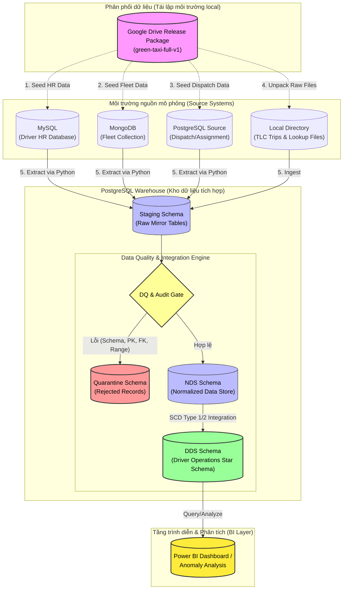

<div align="center">

# 🚕 NYC Green Taxi Driver Operations BI

**Kho dữ liệu phân tích hiệu quả vận hành tài xế và đội xe từ NYC Green Taxi Trip Records**

[](https://www.python.org/)
[](https://www.docker.com/)
[](https://www.postgresql.org/)
[](https://www.mysql.com/)
[](https://www.mongodb.com/)
[](https://powerbi.microsoft.com/)
[](https://github.com/HuyVuCV1011/Green-taxi)

[Tổng quan](#-tổng-quan) • [Điểm nổi bật](#-điểm-nổi-bật) • [Kiến trúc dữ liệu](#-kiến-trúc-dữ-liệu-data-flow) • [Bắt đầu nhanh](#-bắt-đầu-nhanh-quick-start) • [Bản đồ tài liệu](#-bản-đồ-tài-liệu) • [Lộ trình dự án](#-lộ-trình-dữ-liệu) • [Quy tắc dữ liệu](#-quy-tắc-dữ-liệu)

---
</div>

> [!NOTE]
> Đây là repository của đồ án môn **Ứng dụng trí tuệ kinh doanh nâng cao**. Dự án tập trung vào việc tích hợp dữ liệu chuyến đi thực tế từ NYC TLC Green Taxi với các nguồn vận hành mô phỏng (Driver HR, Fleet, Dispatch) để xây dựng kho dữ liệu Driver Operations phục vụ công tác quản lý tài xế và đội xe.

---

## 📌 Tổng quan

Dự án tập trung vào việc giải quyết 5 nhóm câu hỏi vận hành chính của doanh nghiệp taxi thông qua các chỉ số đo lường (KPI):
1. **Hiệu suất tài xế**: Doanh thu, số chuyến đi và năng suất làm việc.
2. **Hiệu quả ca làm**: Thời gian hoạt động, thời gian rảnh, đối soát ca.
3. **Mức sử dụng phương tiện**: Tần suất khai thác và bảo dưỡng xe.
4. **Hiệu quả theo khu vực/thời gian**: Điểm pickup/dropoff phổ biến và thời gian cao điểm.
5. **Chất lượng dữ liệu**: Quản lý bản ghi lỗi, quarantine và đối soát dữ liệu (reconciliation).

### Tóm tắt thông số dự án
- **Dữ liệu chuyến đi (Thật):** NYC TLC Green Taxi trip records.
- **Dữ liệu vận hành (Giả lập):** Driver HR, Fleet, Dispatch Shift, Trip Assignment.
- **Phạm vi phân tích:** Từ tháng 01/2020 đến tháng 07/2021 (19 tháng).
- **Kho dữ liệu đích:** PostgreSQL (`Staging -> DQ/Audit -> NDS -> DDS`).
- **Nhịp xử lý:** Batch theo tháng đối với dữ liệu lịch sử (Không dùng ODS, streaming hay CDC).

---

## 🌟 Điểm nổi bật

- **Mô phỏng nguồn dữ liệu đa dạng:** Khởi tạo các hệ thống nguồn mô phỏng đa dạng (MySQL, MongoDB, PostgreSQL) từ một gói dữ liệu release chuẩn nhằm tái lập môi trường thực tế của doanh nghiệp.
- **Hợp đồng dữ liệu (Data Contracts):** Thiết lập quy định chặt chẽ về schema, kiểu dữ liệu, các business key cho từng nguồn dữ liệu thô.
- **Quản lý chất lượng dữ liệu (DQ):** Tự động phát hiện lỗi schema, tính toàn vẹn tham chiếu, tính hợp lệ của thời gian và đẩy các bản ghi lỗi vào bảng cách ly (Quarantine).
- **Khả năng kiểm toán (Auditability):** Sử dụng cơ chế Manifest, mã băm SHA-256 cho các gói dữ liệu và hệ thống metadata lưu vết xử lý đến từng dòng (Row-level traceability).
- **Mô hình hóa dữ liệu kho:** Thiết kế kho dữ liệu chuẩn hóa NDS (Normalized Data Store) tích hợp và kho dữ liệu DDS (Dimensional Data Store) dạng Star Schema tối ưu hóa cho truy vấn phân tích.

---

## 🏗️ Kiến trúc dữ liệu (Data Flow)

Sơ đồ dưới đây trình bày cách dữ liệu di chuyển từ gói phát hành phát triển (Google Drive Release) để dựng các hệ thống nguồn local, sau đó đi qua các tầng của kho dữ liệu PostgreSQL (DWH) để phục vụ báo cáo BI:



> [!IMPORTANT]
> **Google Drive Release** đóng vai trò là gói phân phối dữ liệu chuẩn để đồng bộ hóa môi trường phát triển local giữa các thành viên của dự án. Nó không được coi là một hệ thống nguồn nghiệp vụ (business source system) trong mô hình vận hành của pipeline thực tế.

---

## 🚀 Bắt đầu nhanh (Quick Start)

Làm theo hướng dẫn dưới đây để thiết lập nhanh môi trường phát triển local và chuẩn bị dữ liệu.

### 📋 Điều kiện cần (Prerequisites)
* Hệ điều hành Windows/Linux/macOS
* **Git**
* **Python 3.11** trở lên
* **Docker Desktop** (hoặc Docker Engine tích hợp Docker Compose v2)

---

### 🛠️ Các bước thiết lập

#### Bước 1: Clone Repository & Cài đặt thư viện Python
```powershell
# Clone mã nguồn dự án
git clone https://github.com/HuyVuCV1011/Green-taxi.git
cd Green-taxi

# Cài đặt các thư viện Python cần thiết
python -m pip install -r requirements.txt
```

#### Bước 2: Khởi tạo tệp cấu hình môi trường `.env`
```powershell
# Sao chép cấu hình mẫu thành tệp cấu hình local hoạt động
Copy-Item configs\.env.example .env
```
*(Bạn có thể chỉnh sửa các cổng kết nối (port) local trong tệp `.env` nếu chúng bị trùng lặp với các phần mềm khác có sẵn trên máy).*

#### Bước 3: Dựng các container cơ sở dữ liệu (Docker Services)
```powershell
# Khởi chạy các container ở chế độ chạy ngầm (detached mode)
docker compose up -d

# Kiểm tra trạng thái hoạt động của các container
docker compose ps
```

#### Bước 4: Tải dữ liệu đầy đủ & Seed vào các hệ thống nguồn
Tải gói dữ liệu release `green-taxi-full-v1.zip` từ Google Drive (theo link chi tiết và mã băm SHA-256 kiểm chứng tại [Tài liệu Onboarding](docs/13-team-onboarding-and-data-setup.md)) giải nén vào thư mục `data/raw/`.

Chạy các tập lệnh seed dữ liệu thô từ thư mục giải nén vào các cơ sở dữ liệu nguồn cục bộ tương ứng:
```powershell
# Seed dữ liệu Driver HR vào MySQL.
# Script tự apply sql/source_mysql_hr/01_driver_tables.sql nếu bảng chưa có.
python scripts/seed_mysql_hr.py --release-id green-taxi-full-v1

# Seed dữ liệu Fleet vào MongoDB
python scripts/seed_mongodb_fleet.py --release-id green-taxi-full-v1

# Seed dữ liệu Dispatch và Trip Assignment vào PostgreSQL Source
python scripts/seed_postgres_dispatch.py --release-id green-taxi-full-v1
```

#### Bước 5: Áp dụng DDL để khởi tạo cấu trúc Kho dữ liệu PostgreSQL
```powershell
# Khởi tạo các schema staging, audit, dq và các bảng mirror tương ứng trong Warehouse
python scripts/apply_warehouse_ddl.py --mode docker
```

---

### 🧪 Chạy thử nghiệm với dữ liệu mẫu (Sample Mode)
Nếu bạn chỉ muốn kiểm thử nhanh logic ETL hoặc xác minh mã nguồn chạy đúng mà không cần tải gói dữ liệu đầy đủ hay thiết lập Docker, hãy chạy bộ kiểm thử sử dụng dữ liệu mẫu có sẵn trong repository:
```powershell
python -m unittest discover -s tests -v
```

---

## 🎛️ Ma trận dịch vụ Docker (Service Matrix)

Các dịch vụ cơ sở dữ liệu được cấu hình sẵn trong `docker-compose.yml` để mô phỏng một môi trường phân tán thực tế:

| Service | Vai trò trong hệ thống | Cổng ánh xạ (Local Port) | Tên Database | Tài khoản mặc định | Tên Volume dữ liệu local |
|---|---|:---:|---|---|---|
| `mysql_hr` | Hệ thống Driver HR nguồn | `3307 -> 3306` | `green_taxi_hr` | `green_taxi_hr_app` | `green_taxi_mysql_hr_data` |
| `mongodb_fleet` | Quản lý đội xe (Fleet) nguồn | `27018 -> 27017` | `green_taxi_fleet` | `green_taxi_fleet_admin` | `green_taxi_mongodb_fleet_data` |
| `postgres_dispatch` | Hệ thống Điều hành (Dispatch) nguồn | `5433 -> 5432` | `green_taxi_dispatch` | `green_taxi_dispatch_app` | `green_taxi_postgres_dispatch_data` |
| `postgres_warehouse` | Kho dữ liệu đích (Warehouse) | `5434 -> 5432` | `green_taxi_warehouse` | `green_taxi_warehouse_app` | `green_taxi_postgres_warehouse_data` |

---

## 📂 Cấu trúc dự án

<details>
<summary><b>Xem cây thư mục chính (Nhấn để mở rộng)</b></summary>

```text
Green-taxi/
|-- configs/              # Cấu hình môi trường an toàn, không chứa secret
|-- data/
|   |-- sample/           # Bộ dữ liệu mẫu nhỏ dùng cho unit test và review nhanh
|   |-- lookup/           # Dữ liệu tra cứu chuẩn (Taxi Zone, Vendor) được phép commit
|   |-- metadata/         # Manifest, checksum và các validation report của generator
|   |-- raw/              # Chứa dữ liệu đầy đủ từ release giải nén ra (Bị Git ignore)
|   |-- interim/          # Thư mục lưu dữ liệu trung gian trong quá trình ETL (Bị Git ignore)
|   `-- processed/        # Kết quả đầu ra sau khi xử lý (Bị Git ignore)
|-- diagrams/             # Sơ đồ kiến trúc và mô hình dữ liệu (.drawio, Mermaid)
|-- docs/                 # Scope, tài liệu kiến trúc, ADR và biên bản họp nhóm
|-- notebooks/            # Các notebook phân tích EDA và thử nghiệm thuật toán
|-- scripts/              # Tập lệnh sinh dữ liệu, seed nguồn và tiện ích quản trị
|-- sql/                  # Tập lệnh SQL DDL, transformation, data tests và truy vấn analytics
|-- src/                  # Mã nguồn Python (Ingestion, DQ, Warehouse, Analytics)
|-- tests/                # Bộ kiểm thử unit test, integration và data-quality
|-- deliverables/         # Báo cáo, slide thuyết trình và bảng tính phân tích bàn giao
`-- archive/              # Tài liệu, code cũ được đưa vào lưu trữ (Chỉ dùng tham khảo)
```
</details>

  [`docs/decisions/`](docs/decisions/).
- Kết quả EDA quan trọng phải có thể tái tạo bằng code.

## Đóng góp

1. Tạo branch theo phạm vi công việc, ví dụ `feature/staging-loader`.
2. Giữ raw data và secret ngoài Git.
3. Chạy `python -m unittest discover -s tests -v`.
4. Tạo pull request và mô tả thay đổi, dữ liệu kiểm thử cùng kết quả
   reconciliation liên quan.
