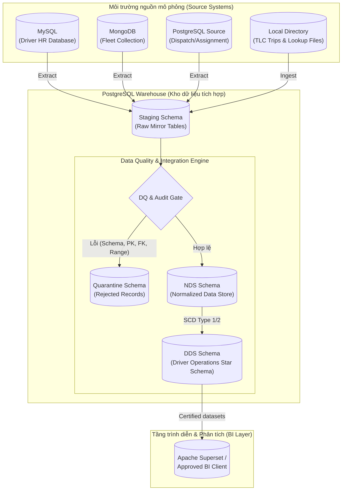
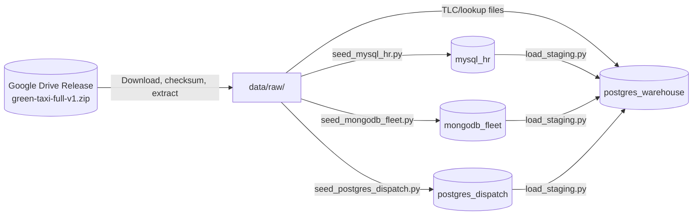
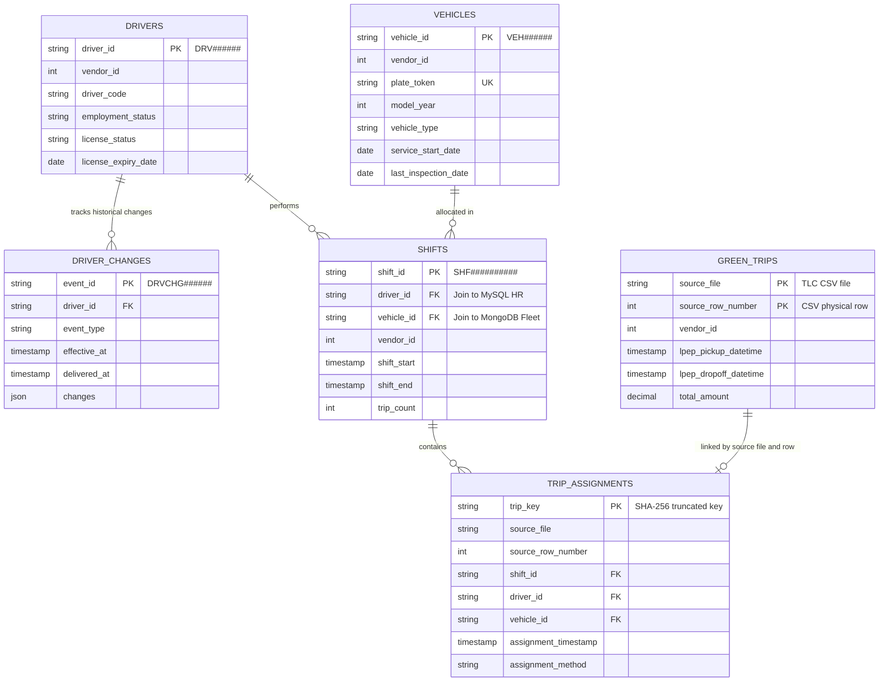

# Diagrams & Visualizations

Thư mục này quản lý các sơ đồ kiến trúc, luồng dữ liệu và mô hình thực thể liên kết (ERD) của dự án.

> [!TIP]
> Bạn có thể lưu các file thiết kế gốc dạng `.drawio` cùng với các tệp ảnh định dạng `.png` hoặc `.svg` được xuất ra tại đây. Mỗi sơ đồ bắt buộc phải nhất quán với các quyết định kiến trúc đã chốt (ADR) và các tài liệu thiết kế liên quan.

---

## Danh mục sơ đồ cần có (Diagram Catalog)

1. **Sơ đồ triển khai vật lý (Physical Deployment Diagram):** Mô tả các container Docker (`mysql_hr`, `mongodb_fleet`, `postgres_dispatch`, `postgres_warehouse`), ánh xạ cổng và mạng nội bộ `green_taxi_net`.
2. **Sơ đồ luồng dữ liệu runtime (Runtime Data Flow Diagram):** Mô tả các bước chuyển đổi dữ liệu từ MySQL/MongoDB/PostgreSQL Dispatch/TLC files -> Staging -> DQ -> NDS -> DDS -> analytics/Superset.
3. **Sơ đồ setup/reproducibility:** Mô tả cách Google Drive release được tải, kiểm checksum, giải nén và seed vào các source systems local.
4. **Mô hình thực thể liên kết nguồn (Source ERD):** Mô tả mối quan hệ giữa các bảng nghiệp vụ giả lập và dữ liệu chuyến đi thực tế.

---

## Các Mermaid Snippets mẫu

Dưới đây là mã Mermaid của các sơ đồ cốt lõi, bạn có thể sử dụng các extension hoặc github viewer để render trực tiếp:

### 1. Kiến trúc luồng dữ liệu runtime (Runtime Data Flow)

### 2. Luồng setup/reproducibility

### 3. Mô hình thực thể liên kết nguồn (Source ERD Schema)
Mô tả quan hệ nghiệp vụ thô trước khi nạp vào staging và kho dữ liệu:

