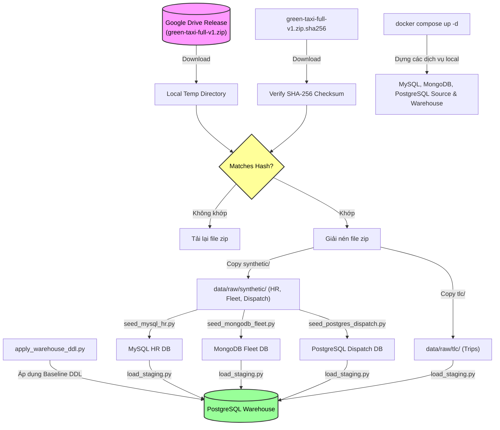

# Team Onboarding and Data Setup Guide

Chào mừng thành viên mới gia nhập đội ngũ phát triển dự án **NYC Green Taxi Driver Operations BI**! Hướng dẫn này sẽ giúp bạn thiết lập môi trường phát triển local nhanh chóng và chuẩn bị dữ liệu đồng bộ với cả nhóm.

---

## Checklist thiết lập nhanh cho thành viên mới

Để bắt đầu làm việc, vui lòng hoàn tất các bước chuẩn bị sau theo thứ tự:

- [ ] **Bước 1: Cài đặt công cụ nền tảng**
  - Cài đặt [Git](https://git-scm.com/)
  - Cài đặt [Python 3.11+](https://www.python.org/)
  - Cài đặt [Docker Desktop](https://www.docker.com/products/docker-desktop/)
- [ ] **Bước 2: Cấu hình mã nguồn & Thư viện local**
  - Clone mã nguồn và cài đặt dependencies thông qua `requirements.txt`
  - Tạo tệp `.env` cấu hình local từ `configs/.env.example`
- [ ] **Bước 3: Tải và Kiểm tra gói dữ liệu (Full Release Package)**
  - Tải file zip dữ liệu từ Google Drive
  - Kiểm tra mã băm SHA-256 của file zip
  - Giải nén và chuyển vào thư mục `data/raw/` của repository
- [ ] **Bước 4: Dựng hạ tầng chứa dữ liệu**
  - Khởi chạy các container bằng `docker compose up -d`
- [ ] **Bước 5: Nạp dữ liệu nguồn & Kho dữ liệu (Seeding & DDL)**
  - Seed dữ liệu vào MySQL HR
  - Seed dữ liệu vào MongoDB Fleet
  - Seed dữ liệu vào PostgreSQL Dispatch
  - Chạy script áp dụng DDL khởi tạo cấu trúc PostgreSQL Warehouse
- [ ] **Bước 6: Nạp dữ liệu vào Warehouse Staging**
  - Chạy smoke load từng nguồn hoặc full load bằng `scripts/load_staging.py`
  - Kiểm tra reconciliation summary của staging loader
- [ ] **Bước 7: Xác minh cài đặt (Verification)**
  - Chạy bộ kiểm thử nhanh với dữ liệu sample: `python -m unittest discover -s tests -v`

---

## Sơ đồ quy trình thiết lập dữ liệu (Data Setup Flow)

Luồng hoạt động dưới đây mô tả các bước thiết lập từ lúc lấy gói phân phối (Release Package) từ Google Drive để nạp vào các hệ thống dữ liệu local:



---

## Cảnh báo bảo mật và quy định dữ liệu cực kỳ quan trọng

> [!WARNING]
> **TUYỆT ĐỐI KHÔNG COMMIT DỮ LIỆU THÔ VÀ BÍ MẬT LÊN GITHUB:**
> * Không commit các tệp tin dữ liệu trong `data/raw/`, `data/interim/`, hoặc `data/processed/`. Các thư mục này đã được đưa vào `.gitignore` để loại bỏ an toàn.
> * Không commit tệp cấu hình chứa mật khẩu `.env` hoặc các thông tin xác thực local.

> [!IMPORTANT]
> **THÀNH VIÊN KHÔNG TỰ Ý CHẠY BỘ SINH DỮ LIỆU (GENERATOR):**
> * Tập lệnh `generate_synthetic_sources.py` trong thư mục `scripts/` chỉ dành cho **Data Owner** khi cần phát hành một bản release mới.
> * Các thành viên bắt buộc phải tải gói dữ liệu phân phối chuẩn từ Google Drive để bảo đảm tính đồng bộ về mã băm checksum, tính toàn vẹn tham chiếu và số lượng dòng đối soát (reconciliation) giữa các môi trường phát triển local.

---

## Hướng dẫn chi tiết các bước thiết lập

### 1. Dựng Docker Services local
Tệp tin `docker-compose.yml` tại thư mục gốc của repository sẽ khởi chạy 4 container cơ sở dữ liệu trên Docker network `green_taxi_net`.

Chạy các lệnh sau trong Windows PowerShell:
```powershell
# Tạo file cấu hình môi trường .env local từ file mẫu
Copy-Item configs\.env.example .env

# Kiểm tra cấu hình Docker Compose
docker compose config

# Khởi động các database containers chạy ngầm
docker compose up -d

# Xem danh sách các dịch vụ đang hoạt động
docker compose ps
```

#### Ma trận dịch vụ Docker local:
| Tên dịch vụ | Nhiệm vụ | Cổng local | Database | User mặc định | Volume dữ liệu |
|---|---|:---:|---|---|---|
| `mysql_hr` | Database Driver HR (Source) | `3307` | `green_taxi_hr` | `green_taxi_hr_app` | `green_taxi_mysql_hr_data` |
| `mongodb_fleet` | Database Fleet (Source) | `27018` | `green_taxi_fleet` | `green_taxi_fleet_admin` | `green_taxi_mongodb_fleet_data` |
| `postgres_dispatch` | Database Dispatch (Source) | `5433` | `green_taxi_dispatch` | `green_taxi_dispatch_app` | `green_taxi_postgres_dispatch_data` |
| `postgres_warehouse` | Kho dữ liệu DWH (Target) | `5434` | `green_taxi_warehouse` | `green_taxi_warehouse_app` | `green_taxi_postgres_warehouse_data` |

> [!TIP]
> Nếu các cổng local (`3307`, `27018`, `5433`, `5434`) bị trùng lặp với phần mềm chạy trên máy của bạn, hãy chỉnh sửa các biến port tương ứng trong tệp `.env` nhưng **giữ nguyên cấu hình service name, database name và user**.

---

### 2. Tải và giải nén gói dữ liệu (Full Data Release)
Thông tin chi tiết về bản phát hành dữ liệu chuẩn:

| Thuộc tính | Giá trị |
|---|---|
| **Storage Provider** | Google Drive |
| **Đường dẫn thư mục** | [Google Drive Release Folder](https://drive.google.com/drive/folders/1a9wjCly_R1c_sTSq89cONAE-rCWmwuiZ) |
| **Data Release ID** | `green-taxi-full-v1` |
| **Tệp tin cần tải** | `green-taxi-full-v1.zip` và `green-taxi-full-v1.zip.sha256` |
| **Mã băm SHA-256** | `e916e88b2e67fa90d5a5b536c3ac7c82a4f6b21fbfb01735e8c5e5e254be7b01` |
| **Múi giờ nghiệp vụ** | `America/New_York` (Ghi nhận trong tệp nguồn) |
| **Múi giờ kiểm toán** | `UTC` (Sử dụng cho hệ thống audit và timestamps ETL) |

#### Các bước tải và kiểm tra:
1. Truy cập đường dẫn Google Drive ở trên, tải 2 file `green-taxi-full-v1.zip` và `green-taxi-full-v1.zip.sha256` về máy tính (khuyên dùng đặt ở thư mục tạm ngoài repository, ví dụ: `D:\Master\`).
2. Mở Windows PowerShell và kiểm tra tính toàn vẹn của tệp tải về:
   ```powershell
   # Tính mã băm file zip đã tải
   Get-FileHash "D:\Master\green-taxi-full-v1.zip" -Algorithm SHA256

   # Đọc mã băm chuẩn trong file sha256 đi kèm
   Get-Content "D:\Master\green-taxi-full-v1.zip.sha256"
   ```
   *Mã băm trả về bắt buộc phải khớp chính xác với mã băm: `e916e88b2e67fa90d5a5b536c3ac7c82a4f6b21fbfb01735e8c5e5e254be7b01`*. Nếu không khớp, vui lòng xóa tệp và tải lại.
3. Giải nén file zip bằng PowerShell:
   ```powershell
   Expand-Archive -LiteralPath "D:\Master\green-taxi-full-v1.zip" -DestinationPath "D:\Master" -Force
   ```
4. Di chuyển dữ liệu đã giải nén vào thư mục `data/raw/` của dự án theo đúng sơ đồ ánh xạ sau:
   ```text
   D:\Master\green-taxi-full-v1\tlc        ->  green-taxi-bi-project\data\raw\tlc
   D:\Master\green-taxi-full-v1\synthetic  ->  green-taxi-bi-project\data\raw\synthetic
   ```
   Lệnh thực hiện nhanh:
   ```powershell
   New-Item -ItemType Directory -Force "data/raw" | Out-Null
   Copy-Item -Recurse -Force "D:\Master\green-taxi-full-v1\tlc" "data/raw\"
   Copy-Item -Recurse -Force "D:\Master\green-taxi-full-v1\synthetic" "data/raw\"
   ```

---

### 3. Cấu trúc tệp tin của gói dữ liệu đầy đủ
Sau khi hoàn tất việc di chuyển dữ liệu giải nén, thư mục dự án của bạn sẽ có cấu trúc như sau:

```text
green-taxi-bi-project/
`-- data/
    `-- raw/
        |-- tlc/
        |   `-- year=2020/
        |       `-- month=01/
        |           `-- green_tripdata_2020-01.csv  # ... cho đến month=12
        |   `-- year=2021/
        |       `-- month=01/                       # ... cho đến month=07
        `-- synthetic/
            |-- driver_hr/
            |   |-- drivers.csv
            |   `-- driver_changes.jsonl
            |-- fleet/
            |   `-- vehicles.jsonl
            |-- dispatch/
            |   `-- shifts.tsv
            `-- trip_assignment/
                |-- assignment_exceptions.csv
                `-- year=2020/month=01/trip_assignment_2020-01.csv  # ...
```

---

### 4. Nạp dữ liệu nguồn (Source Databases Seeding)
Các tập lệnh seed được cấu hình có tính chất **idempotent** (chạy lại nhiều lần không sinh trùng lặp bản ghi, dữ liệu cũ sẽ được cập nhật/ghi đè tương ứng).

#### A. Seed MySQL Driver HR
Khởi tạo cấu trúc bảng nghiệp vụ nguồn và nạp dữ liệu. Script tự apply
`sql/source_mysql_hr/01_driver_tables.sql`, nên thành viên mới không cần chạy
lệnh MySQL DDL thủ công:
```powershell
# Bảo đảm mysql_hr đã hoạt động
docker compose up -d mysql_hr

# Chạy script Python để nạp dữ liệu thô
python scripts/seed_mysql_hr.py --release-id green-taxi-full-v1
```

`00_create_schema.sql` chỉ dùng cho trường hợp nâng cao khi tự dựng MySQL ngoài
Docker Compose. Với `docker-compose.yml` của repo, database `green_taxi_hr` đã
được container tạo từ biến `MYSQL_HR_DATABASE`.

#### B. Seed MongoDB Fleet
Nạp dữ liệu phương tiện từ vehicles.jsonl vào cơ sở dữ liệu MongoDB:
```powershell
# Chạy script Python nạp Fleet
python scripts/seed_mongodb_fleet.py --release-id green-taxi-full-v1
```
*Số lượng bản ghi Fleet dự kiến sau khi seed:* `vehicles = 860` tài liệu.

#### C. Seed PostgreSQL Dispatch
Áp dụng DDL và nạp dữ liệu ca làm việc, phân bổ chuyến đi vào PostgreSQL Source:
```powershell
# Chạy script Python nạp Dispatch & Assignments
python scripts/seed_postgres_dispatch.py --release-id green-taxi-full-v1
```

##### 📊 Số lượng bản ghi kiểm chứng sau khi seed thành công:
| Bảng cơ sở dữ liệu nguồn | Số dòng dữ liệu dự kiến |
|---|---:|
| `public.shifts` | 157,379 |
| `public.trip_assignments` | 2,304,276 |
| `public.assignment_exceptions` | 241 |

---

### 5. Áp dụng DDL baseline cho Kho dữ liệu (Warehouse Target)
Kho dữ liệu phân tích PostgreSQL (`postgres_warehouse`) cần được khởi tạo cấu trúc bảng mirror thô (Staging) và các bảng phục vụ quản lý chất lượng (Audit, DQ):

```powershell
# Bảo đảm postgres_warehouse đang hoạt động
docker compose up -d postgres_warehouse

# Áp dụng cấu trúc bảng cho các schema staging, audit và dq
python scripts/apply_warehouse_ddl.py --mode docker
```
*Chi tiết các bảng và cấu trúc cơ sở dữ liệu kho, xem thêm tại [Warehouse DDL Baseline](14-warehouse-ddl.md).*

---

### 6. Nạp dữ liệu vào Warehouse Staging (Warehouse Staging Load)
Sau khi seed thành công các hệ thống nguồn và áp dụng DDL khởi tạo cấu trúc bảng trong Warehouse, bước tiếp theo là trích xuất dữ liệu từ các cơ sở dữ liệu nguồn và tệp tin thô để nạp vào các bảng Staging tương ứng:

```powershell
# Nên smoke test từng nguồn trước khi full load
python scripts/load_staging.py --release-id green-taxi-full-v1 --source hr
python scripts/load_staging.py --release-id green-taxi-full-v1 --source fleet
python scripts/load_staging.py --release-id green-taxi-full-v1 --source dispatch
python scripts/load_staging.py --release-id green-taxi-full-v1 --source lookup
python scripts/load_staging.py --release-id green-taxi-full-v1 --source tlc --limit-files 1
```

Sau khi smoke path pass và reconciliation không lệch, có thể chạy full load:

```powershell
python scripts/load_staging.py --release-id green-taxi-full-v1 --source all
```

Để hiểu rõ hơn về kiến trúc, cơ chế sinh mã băm `row_hash`, idempotency và cách đối soát số dòng, xem thêm tại [Hướng dẫn Load Warehouse Staging](15-staging-load.md).

### 7. Khởi chạy Giao diện điều khiển đối soát (Pipeline Control Panel) - Tùy chọn
Sau khi hoàn tất nạp Staging, bạn có thể khởi chạy ứng dụng Streamlit để kiểm tra trực quan sức khỏe kết nối và đối soát số lượng dòng dữ liệu:

```powershell
streamlit run app/streamlit_app.py
```
Để biết thêm chi tiết, xem thêm tại [Pipeline Control Panel](16-pipeline-control-panel.md).

---

## Các chế độ kiểm thử và làm việc

### 1. Chế độ dữ liệu mẫu (Sample Mode)
* **Mục tiêu:** Phục vụ chạy Unit Tests nhanh, thiết lập luồng CI (Continuous Integration) hoặc khi cần phát triển nhanh logic ETL mà không cần tải full data hay dựng Docker.
* **Cách hoạt động:** Các tập lệnh đọc trực tiếp từ thư mục dữ liệu mẫu đã có sẵn trong Git: `data/sample/`.
* **Lệnh chạy:**
  ```powershell
  python -m unittest discover -s tests -v
  ```

### 2. Chế độ dữ liệu đầy đủ (Full Mode)
* **Mục tiêu:** Chạy trích xuất toàn bộ dữ liệu thực tế, seed nguồn, nạp
  staging và đối soát chất lượng dữ liệu trên quy mô đầy đủ. NDS/DDS và báo cáo
  BI là các milestone tiếp theo.
* **Cách hoạt động:** Yêu cầu các container Docker phải chạy, dữ liệu trong `data/raw/` đã được seed đầy đủ vào các nguồn MySQL, MongoDB, PostgreSQL Source.

---

## Phân định trách nhiệm và sở hữu (Ownership Matrix)

| Mảng công việc | Thành viên sở hữu | Phạm vi chịu trách nhiệm |
|---|---|---|
| **GitHub & Architecture Docs** | Team Lead | Quản lý repo, phê duyệt pull request và tài liệu thiết kế. |
| **Canonical Data Releases** | Data Owner | Chịu trách nhiệm về generator, tính toàn vẹn của release package. |
| **Source Seeding & Adapters** | Ingestion Owner | Viết các loader nạp dữ liệu từ nguồn vào staging và đối soát nguồn. |
| **Warehouse Core (DWH)** | Warehouse Owner | Phát triển logic ETL staging -> NDS -> DDS, quản lý DQ và Quarantine. |
| **Local Config & Volumes** | Từng thành viên | Quản lý file `.env` local, volumes Docker local và raw data local. |

Khi làm việc với repository, luôn tuân thủ nguyên tắc: **Tạo nhánh phát triển riêng (ví dụ `feature/dq-loader`), pass toàn bộ unittest mẫu trước khi tạo Pull Request.**
