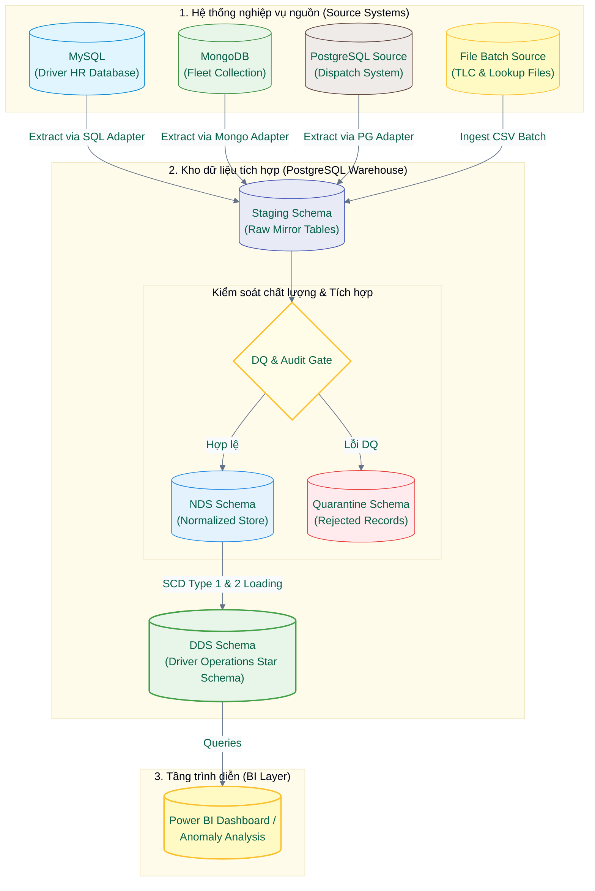
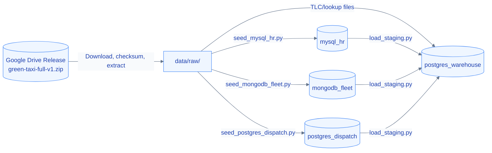

# 📐 Kiến trúc Hệ thống (System Architecture)

> Trạng thái: `IMPLEMENTED BASELINE; FRESH-ENV FULL VALIDATION PENDING`

---

## 📌 Nguyên tắc Kiến trúc (Architectural Principles)

1.  **Ranh giới Sở hữu rõ ràng:** Hệ thống nghiệp vụ nguồn và kho dữ liệu tích hợp (Warehouse) phải có ranh giới rõ ràng về quyền sở hữu dữ liệu.
2.  **Google Drive Release:** Chỉ sử dụng để phân phối và seed dữ liệu local; không thay thế hay đóng vai trò là một hệ thống nguồn trực tiếp.
3.  **Staging Contract Ổn định:** Staging contract phải được giữ vững cho dù cơ chế trích xuất (extract) của từng nguồn dữ liệu khác nhau.
4.  **Kiểm soát Batch nghiêm ngặt:** Mọi lô dữ liệu (batch) phải có Lineage, Checksum/Watermark, Row Count và tính Idempotency rõ ràng.
5.  **Chuẩn hóa & Tích hợp:** NDS chịu trách nhiệm chuẩn hóa tích hợp dữ liệu; DDS tối ưu hóa cấu trúc Star Schema phục vụ phân tích Driver Operations.
6.  **Tối giản Kiến trúc:** Không bổ sung ODS, MinIO, streaming hay CDC khi chưa xuất hiện yêu cầu nghiệp vụ thực tế.

> [!NOTE]
> Các thành viên trong nhóm cần tải bản release dữ liệu `green-taxi-full-v1.zip` từ Google Drive, kiểm tra mã băm SHA-256 và thực hiện giải nén theo hướng dẫn tại [Tài liệu Onboarding](00-team-onboarding-and-data-setup.md) trước khi chạy chế độ full mode.

---

## 📐 Kiến trúc Logic (Logical Architecture)

Sơ đồ runtime dưới đây mô tả pipeline ở góc nhìn nghiệp vụ/vận hành. Google Drive không phải là hệ thống nguồn nghiệp vụ nên không nằm trên luồng chính này.

---

## 🔄 Quy trình Khởi tạo & Tái lập (Local Setup Flow)

Google Drive chỉ xuất hiện trong luồng chuẩn bị dữ liệu và khởi tạo môi trường local:

---

## 🎛️ Kiến trúc Vật lý (Physical Deployment)

Docker Compose định nghĩa 4 dịch vụ dữ liệu chính phục vụ mô phỏng local:

| Compose Service | Công nghệ | Vai trò trong hệ thống |
| :--- | :--- | :--- |
| `mysql_hr` | MySQL 8.4 | Quản lý Driver Master và các sự kiện thay đổi nhân sự (HR changes) |
| `mongodb_fleet` | MongoDB 7.0 | Quản lý thông tin chi tiết phương tiện (Vehicle documents) |
| `postgres_dispatch` | PostgreSQL 16 | Quản lý lịch trình ca làm (Shifts) và chỉ định chuyến đi (Trip assignments) |
| `postgres_warehouse` | PostgreSQL 16 | Kho dữ liệu tích hợp chứa các schema: Staging, DQ/Audit, NDS và DDS |

> [!NOTE]
> Các tệp tin TLC trips và lookup files được mount trực tiếp từ thư mục `data/raw/`; không cần cấu hình hệ thống lưu trữ đối tượng MinIO. Mỗi dịch vụ được cấp một cơ sở dữ liệu, thông tin đăng nhập và volume lưu trữ độc lập. Warehouse tuyệt đối không query trực tiếp các bảng của DB nguồn trong quá trình biến đổi dữ liệu SQL.

---

## ⚡ Luồng Khởi tạo & Seed (Bootstrap and Seed Flow)

Các cơ sở dữ liệu nguồn được thiết lập dưới dạng các snapshot/chỉ mục có thể tái lập:

1.  Thành viên tải đúng bản release từ Google Drive và xác minh SHA-256.
2.  Docker Compose khởi tạo các services nguồn và warehouse.
3.  Tập lệnh Seed đọc gói release và thực hiện upsert/replace dữ liệu dựa theo Natural Key.
4.  Tiến trình đối soát Seed kiểm tra tính toàn vẹn thông qua Row Count và Checksum.
5.  Adapter Ingestion kéo dữ liệu từ các interfaces nguồn và nạp vào Staging.

> [!IMPORTANT]
> Tiến trình seed bắt buộc phải **idempotent**: Việc chạy lại cùng một release nhiều lần không được làm nhân bản bản ghi (duplicates) hoặc thay đổi nội dung nghiệp vụ lịch sử. Các script generator chỉ dùng cho data owner sinh gói dữ liệu release, không nằm trong onboarding flow thông thường.

---

## 🔌 Ranh giới các Source Adapters (Source Adapter Boundary)

Mỗi adapter chịu trách nhiệm kết nối, chuẩn hóa kỹ thuật và phát ra bản ghi theo staging contract:

| Adapter | Input | Đơn vị trích xuất (Extraction Unit) |
| :--- | :--- | :--- |
| **TLC file adapter** | CSV/Parquet theo tháng | File/batch |
| **Lookup file adapter** | CSV | File snapshot |
| **HR adapter** | MySQL tables | Snapshot + ordered change events |
| **Fleet adapter** | MongoDB collection | Document snapshot |
| **Dispatch adapter** | PostgreSQL tables | Shift/assignment batch |

> [!TIP]
> Nhiệm vụ của adapter là trích xuất dữ liệu, định dạng kiểu dữ liệu thô và thêm các metadata kỹ thuật tối thiểu. Tuyệt đối không thực hiện bất kỳ biến đổi nghiệp vụ (Business transformation) nào tại tầng source adapter.

---

## 📥 Tầng Staging (Staging Schema)

Mỗi bảng nguồn có một bảng mirror tương ứng ở Staging schema với cấu trúc gần như nguyên bản. Các cột metadata kỹ thuật dùng chung gồm:

*   `release_id`: Phiên bản dữ liệu phát hành
*   `batch_id`: Mã định danh lô xử lý
*   `source_system`: Hệ thống nguồn phát sinh
*   `source_entity`: Tên bảng/collection nguồn
*   `source_locator`: Đường dẫn/định vị dữ liệu gốc
*   `source_record_id`: ID bản ghi nguồn (Natural Key hoặc Document ID)
*   `source_extract_at`: Thời điểm trích xuất từ nguồn
*   `load_timestamp`: Thời điểm nạp vào Staging
*   `row_hash`: Mã băm SHA-256 kiểm tra trùng lặp và biến đổi dòng
*   `source_checksum`: Mã băm kiểm tra file nguồn
*   `extraction_watermark`: Watermark dùng cho việc trích xuất gia tăng (nếu có)

> [!NOTE]
> Đối với nguồn tệp tin, staging bổ sung hai cột: `source_file` và `source_row_number`. Đối với nguồn database/document, `source_record_id` lưu trữ natural key của nguồn; không tự sinh row number ảo. `source_checksum` là bắt buộc đối với tệp tin và chấp nhận NULL đối với cơ sở dữ liệu.

---

## ⏰ Xử lý Thời gian (Time Handling)

*   **Múi giờ nghiệp vụ:** Toàn bộ mốc thời gian giao dịch nghiệp vụ (TLC và synthetic sources) được xử lý theo múi giờ New York (`America/New_York`).
*   **Kiểu dữ liệu:** PostgreSQL Staging/NDS sử dụng kiểu dữ liệu `TIMESTAMP WITHOUT TIME ZONE` để tránh tự động biến đổi múi giờ khi lưu trữ dữ liệu nghiệp vụ gốc.
*   **MySQL:** Sử dụng kiểu dữ liệu `DATETIME` cho business timestamps.
*   **MongoDB:** Seed adapter tự động chuyển đổi local timestamp sang kiểu BSON UTC một cách tường minh trước khi ghi.
*   **Mốc thời gian hệ thống:** Toàn bộ mốc thời gian xử lý và kiểm toán (Audit/Processing timestamps) dùng kiểu `TIMESTAMPTZ` ở múi giờ UTC.
*   **DST Cảnh báo:** DQ Gate có nhiệm vụ phát hiện và đánh dấu (flag) các mốc thời gian DST mơ hồ hoặc không tồn tại, tuyệt đối không tự dịch chuyển giờ mà không ghi vết.

---

## 🛡️ Tầng Kiểm soát Chất lượng & Kiểm toán (DQ/Audit)

Tầng này thực thi các validation rules trước khi cho phép dữ liệu đi vào NDS:
*   Kiểm tra Schema & Kiểu dữ liệu.
*   Kiểm tra trùng lặp (Duplicate) và Natural Key.
*   Kiểm tra ràng buộc thời gian và tham chiếu chéo (Temporal & Referential validation).
*   Đối soát số dòng (Staging to Warehouse Row Count Reconciliation).
*   Kiểm tra tính toàn vẹn của tệp (Checksum audit).
*   Đối soát gói dữ liệu Seed (Release to Source Reconciliation).
*   Cách ly bản ghi lỗi (Quarantine schema) phục vụ phân tích.

---

## 🏢 Tầng Dữ liệu Chuẩn hóa (NDS Schema)

Tầng NDS (Normalized Data Store) tổ chức dữ liệu tích hợp dưới dạng chuẩn hóa 3NF gồm các bảng:

*   `ref_source_system`
*   `nds_driver`, `nds_driver_history` (Quản lý lịch sử SCD2)
*   `nds_vehicle` (Lịch sử đội xe)
*   `nds_vendor` (Thông tin đối tác)
*   `nds_location` (Vùng đón/trả khách)
*   `nds_shift` (Lịch trình làm việc)
*   `nds_trip`, `nds_trip_assignment` (Thông tin chuyến đi và chỉ định tài xế)
*   `metadata_etl_batch`, `metadata_source_extract` (Tracking lineage)
*   `dq_issue`, `dq_missing_master` (Giám sát chất lượng)

---

## 🏢 Tầng Dữ liệu Chiều (DDS Schema)

Tầng DDS thiết kế theo mô hình hình sao (Star Schema) tối ưu hóa tối đa cho Power BI:

### Dimensions (Bảng chiều):
*   `dim_date` / `dim_time`: Hỗ trợ phân tích thời gian chi tiết.
*   `dim_driver`: Quản lý thông tin tài xế (áp dụng SCD Type 2).
*   `dim_vehicle`: Quản lý thông tin phương tiện (áp dụng SCD Type 2).
*   `dim_vendor`: Quản lý thông tin nhà cung cấp (SCD Type 1).
*   `dim_location`: Quản lý vị trí địa lý (Type 0).

### Facts (Bảng sự kiện):
*   `fact_driver_trip`: Ghi nhận chi tiết từng giao dịch chuyến đi.
*   `fact_driver_shift`: Ghi nhận hiệu suất ca làm việc của tài xế.

> [!NOTE]
> Mã `shift_id` được thiết kế dưới dạng **Degenerate Dimension** trực tiếp trong hai bảng fact; không xây dựng bảng `dim_shift` độc lập do quan hệ 1:1 với `fact_driver_shift` không đem lại hiệu quả phân tích cộng thêm.

---

## 🧠 Tại sao không sử dụng tầng ODS?

Dự án này phục vụ bài toán xử lý dữ liệu lịch sử theo **Batch định kỳ hàng tháng** phục vụ báo cáo quản trị cấp trung và cấp cao. Doanh nghiệp không có nhu cầu điều hành tác nghiệp theo thời gian thực (real-time/near real-time ops). Do đó, việc xây dựng một tầng dữ liệu tác nghiệp ODS sẽ làm tăng chi phí hạ tầng, tăng rủi ro đồng bộ dữ liệu mà không mang lại giá trị thực tế. NDS sẽ đóng vai trò tích hợp trung tâm và DDS chịu trách nhiệm phục vụ truy vấn phân tích trực quan.

---

## ⏳ Nhịp độ Xử lý (Processing Cadence)

Hệ thống xử lý định kỳ theo tháng (Monthly Batch) đối với dữ liệu chuyến đi TLC và trip assignments. Dữ liệu Master data (HR, Fleet) được đồng bộ theo từng phiên bản phát hành (release batch). Cấu trúc của các adapters sẵn sàng hỗ trợ chuyển dịch sang xử lý hàng ngày (Daily Batch) khi có yêu cầu; các cơ chế xử lý luồng (streaming) hoặc CDC hiện tại không nằm trong phạm vi phát triển.

---

## 🛠️ Cơ chế Phục hồi & Khởi chạy lại (Failure and Restart Model)

*   **Source database lỗi:** Các tiến trình seeding và extraction sẽ dừng ngay lập tức.
*   **Lệch dữ liệu kiểm tra:** Dừng pipeline ngay tại bước đối soát trước khi ghi vào kho.
*   **Khởi chạy lại một Lô thành công:** Hệ thống hỗ trợ skip hoặc ghi đè (reload) có kiểm soát để tránh ghi trùng dữ liệu.
*   **Xử lý Lô lỗi:** Tự động rollback các phần dữ liệu đã nạp của lô bị lỗi, đưa hệ thống về trạng thái nhất quán trước khi chạy lại.
*   **Ranh giới DQ:** Chỉ cho phép các dữ liệu từ staging đã vượt qua DQ Gate đi vào NDS và DDS.

---

## 🎛️ Orchestration & Giao diện Vận hành

*   **`PipelineRunner`**: Đảm nhận nhiệm vụ điều phối trình tự chạy của các loaders: `source_health -> load_staging -> load_nds -> load_dds -> reconciliation -> mark_dds_ready`.
*   **CLI**: Thực thi tại [scripts/run_pipeline.py](file:///d:/Master/%E1%BB%A8ng%20d%E1%BB%A5ng%20tr%C3%AD%20tu%E1%BB%87%20kinh%20doanh%20n%C3%A2ng%20cao/green-taxi-bi-project/scripts/run_pipeline.py).
*   **Control Panel**: Giao diện Streamlit 4 tab (`Tổng quan Hệ thống`, `Vận hành Pipeline`, `Chất lượng & Đối soát`, `Khám phá Nguồn`). Auto-Demo chạy kịch bản tự động được bọc trong một expander riêng tại Tab vận hành để tránh kích hoạt ngoài ý muốn.
*   **Cơ chế Lock:** Sử dụng file lock [data/.pipeline.lock](file:///d:/Master/%E1%BB%A8ng%20d%E1%BB%A5ng%20tr%C3%AD%20tu%E1%BB%87%20kinh%20doanh%20n%C3%A2ng%20cao/green-taxi-bi-project/data/.pipeline.lock) để kiểm soát phiên chạy độc quyền. Các lỗi sập nguồn/kill process đột ngột khiến `finally` block không kịp chạy giải phóng lock sẽ được tự động xử lý và khôi phục (Stale lock recovery) ở lượt acquire tiếp theo thông qua kiểm tra timestamp và PID hoạt động.
