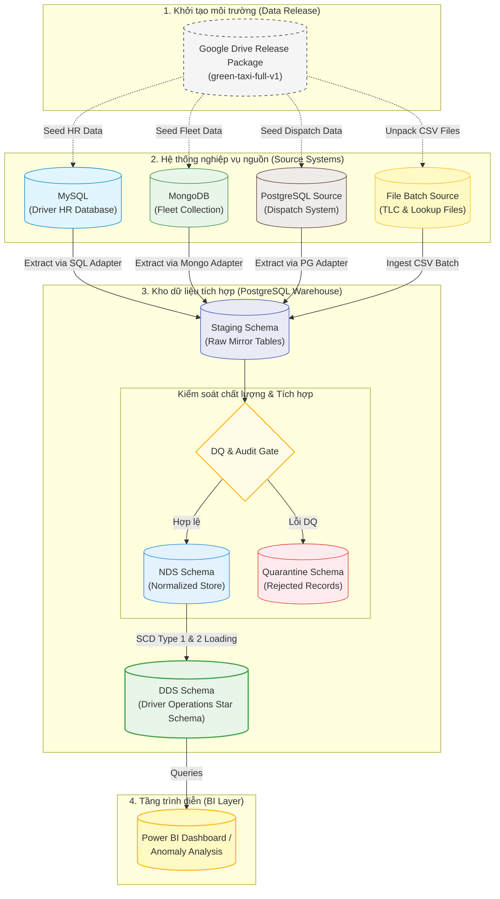

# System Architecture

Status: `APPROVED FOR IMPLEMENTATION`

## Architectural principles

1. Nguồn nghiệp vụ và warehouse phải có ranh giới sở hữu rõ ràng.
2. Google Drive release chỉ dùng để phân phối/seed, không thay thế source system.
3. Staging contract ổn định dù cơ chế extract của từng nguồn khác nhau.
4. Mọi batch phải có lineage, checksum/watermark, row count và idempotency.
5. NDS tích hợp dữ liệu; DDS tối ưu cho Driver Operations analytics.
6. Không thêm ODS, MinIO, streaming hoặc CDC khi chưa có business requirement.

Team member tải release `green-taxi-full-v1.zip` từ Google Drive, kiểm SHA-256
và giải nén theo `docs/13-team-onboarding-and-data-setup.md` trước khi chạy full
mode.

## Logical architecture

## Physical deployment

Docker Compose có bốn data services:

| Compose service | Công nghệ | Vai trò |
|---|---|---|
| `mysql_hr` | MySQL | Driver master và HR changes |
| `mongodb_fleet` | MongoDB | Vehicle documents |
| `postgres_dispatch` | PostgreSQL | Shifts và trip assignments |
| `postgres_warehouse` | PostgreSQL | Staging, DQ/Audit, NDS và DDS |

TLC trip và lookup files được mount/read từ `data/raw/`; không cần MinIO trong
scope chính. Mỗi service dùng database, credential và volume riêng. Warehouse
không query trực tiếp bảng nguồn trong transformation SQL.

## Bootstrap and seed flow

Các source databases là môi trường mô phỏng có thể tái tạo:

1. Thành viên tải đúng Google Drive release và kiểm tra SHA-256.
2. Docker Compose tạo source services và warehouse service.
3. Seed command đọc release và upsert/replace dữ liệu theo natural key.
4. Seed audit xác nhận row count và checksum tương ứng release.
5. Ingestion command extract từ source interfaces vào staging.

Seed phải idempotent: chạy lại cùng release không tạo duplicate hoặc thay đổi
business content. Generator không nằm trong onboarding flow.

## Source adapter boundary

Mỗi adapter chịu trách nhiệm kết nối và phát ra record theo staging contract:

| Adapter | Input | Extraction unit |
|---|---|---|
| TLC file adapter | CSV/Parquet tháng | File/batch |
| Lookup file adapter | CSV | File snapshot |
| HR adapter | MySQL tables | Snapshot + ordered change events |
| Fleet adapter | MongoDB collection | Document snapshot |
| Dispatch adapter | PostgreSQL tables | Shift/assignment batch |

Adapter chỉ thực hiện extraction, serialization chuẩn và metadata kỹ thuật tối
thiểu. Business transformation không được đẩy ngược vào source adapter.

## Staging

Mỗi nguồn có schema/table mirror gần nguyên bản. Metadata dùng chung:

- `release_id`
- `batch_id`
- `source_system`
- `source_entity`
- `source_locator`
- `source_record_id`
- `source_extract_at`
- `load_timestamp`
- `row_hash`
- `source_checksum`
- `extraction_watermark`

Với nguồn file, staging bổ sung `source_file` và `source_row_number`. Với nguồn
database/document, `source_record_id` chứa primary key/natural key hoặc document
ID; không giả lập row number nếu nguồn không có khái niệm đó. `source_checksum`
required cho file source và nullable cho database/document source.
`extraction_watermark` nullable cho full snapshot và chỉ required khi adapter
thực sự dùng incremental extraction.

## Time handling

- Business timestamps từ TLC và synthetic sources được hiểu theo
  `America/New_York`.
- PostgreSQL source/staging dùng `TIMESTAMP WITHOUT TIME ZONE` cho business
  timestamps để bảo toàn giá trị nguồn.
- MySQL dùng `DATETIME` cho business timestamps.
- MongoDB seed adapter chuyển local timestamp sang BSON UTC một cách tường minh.
- Audit/processing timestamps dùng UTC `TIMESTAMPTZ`.
- Container/session timezone không được dùng như một implicit conversion rule.
- DQ phải flag timestamp DST mơ hồ/không tồn tại và không tự dịch giờ.

## DQ/Audit

- Schema/type validation.
- Duplicate và natural-key validation.
- Temporal and referential validation.
- Source-to-staging row-count reconciliation.
- File checksum hoặc source extraction audit.
- Seed release-to-source reconciliation.
- Quarantine cho record không thể tích hợp.

## NDS

Các bảng dự kiến:

- `nds_driver`
- `nds_driver_history`
- `nds_vehicle`
- `nds_vendor`
- `nds_location`
- `nds_shift`
- `nds_trip`
- `nds_trip_assignment`
- `metadata_etl_batch`
- `metadata_source_extract`
- `dq_issue`
- `dq_missing_master`

NDS giữ natural key, surrogate key, source system và lịch sử cần thiết.

## DDS

Dimensions:

- `dim_date`
- `dim_time`
- `dim_driver` - SCD Type 2
- `dim_vehicle` - SCD Type 2
- `dim_vendor` - SCD Type 1
- `dim_location` - Type 0 cho phạm vi case study
- `dim_shift`

Facts:

- `fact_driver_trip`
- `fact_driver_shift`

## Tại sao không dùng ODS

Dự án xử lý dữ liệu lịch sử theo batch và không có quyết định ngắn hạn cần một
operational view gần thời gian thực. Vì vậy ODS không tạo thêm giá trị đủ lớn.
NDS chịu trách nhiệm tích hợp và chuẩn hóa; DDS phục vụ phân tích.

## Processing cadence

Batch theo tháng cho TLC trips và assignments; master snapshots/change events
được xử lý theo batch tương ứng release. Thiết kế adapter cho phép chuyển sang
batch hằng ngày, nhưng streaming/CDC không thuộc yêu cầu hiện tại.

## Failure and restart model

- Source service chưa healthy: seed/extract không chạy.
- Checksum hoặc seed count lệch: dừng trước ingestion.
- Batch đã hoàn tất với cùng source identity: skip hoặc reload có kiểm soát.
- Batch thất bại: rollback vùng load của batch và cho phép chạy lại.
- NDS/DDS chỉ đọc staging batch đã đạt DQ gate.
