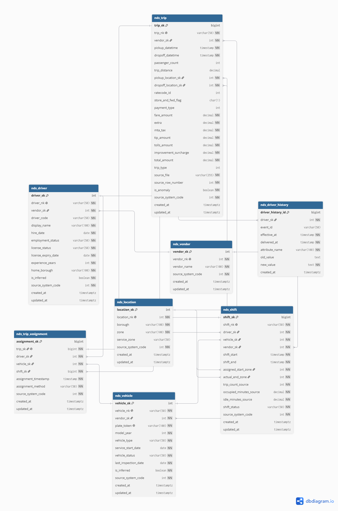
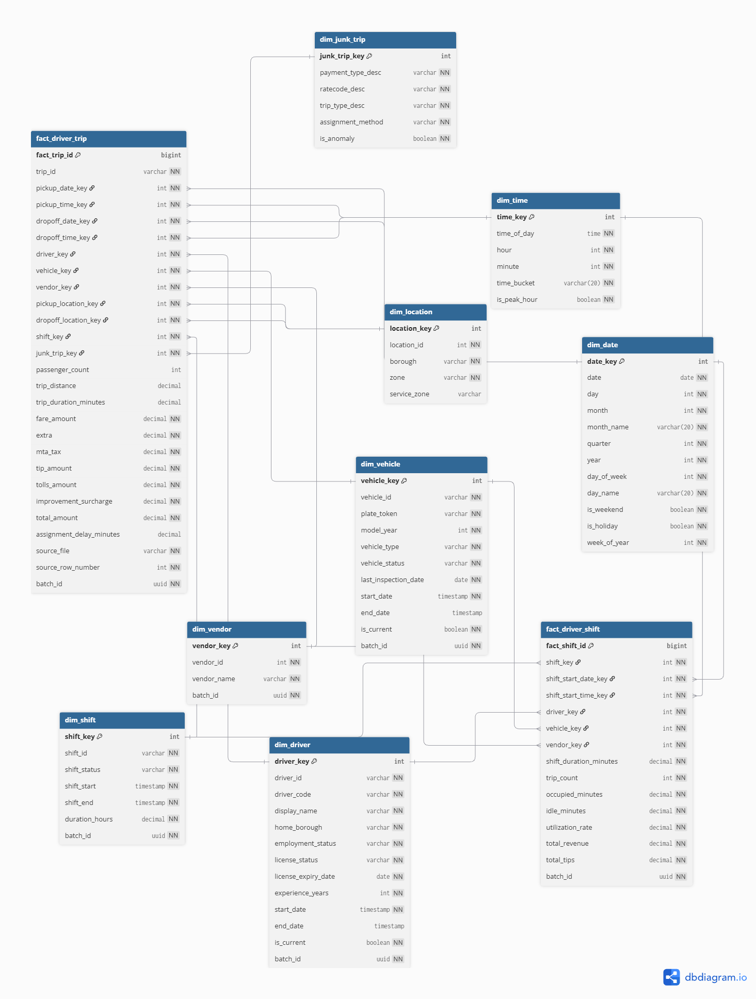

# Warehouse DDL Baseline (Staging, NDS & DDS Schemas)

Tài liệu này đặc tả thiết kế cấu trúc cơ sở dữ liệu (DDL SQL) hoàn chỉnh cho kho dữ liệu PostgreSQL của dự án **NYC Green Taxi Driver Operations BI**, bao gồm 4 schema chính:
1. `staging`: Lưu trữ dữ liệu raw mirror.
2. `audit`: Ghi nhận nhật ký chạy batch, kiểm soát và đối soát.
3. `nds`: Lưu trữ dữ liệu chuẩn hóa quan hệ 3NF tích hợp.
4. `dds`: Lưu trữ mô hình chiều hình sao (Star Schema) tối ưu cho báo cáo phân tích.
5. `dq`: Lưu trữ log lỗi chất lượng dữ liệu và các bảng quarantine.

---

## 1. Kiến trúc Schema tổng thể

```sql
-- Khởi tạo các schema chính trong PostgreSQL Warehouse
CREATE SCHEMA IF NOT EXISTS staging;
CREATE SCHEMA IF NOT EXISTS audit;
CREATE SCHEMA IF NOT EXISTS nds;
CREATE SCHEMA IF NOT EXISTS dds;
CREATE SCHEMA IF NOT EXISTS dq;
```

---

## 1. Sơ đồ Quan hệ NDS (Normalized Data Store - 3NF)

Dưới đây là sơ đồ thực thể chuẩn hóa 3NF của tầng NDS:



> 🔗 *Mã nguồn thiết kế: [nds_schema.dbml](../diagrams/nds_schema.dbml). Bạn có thể sao chép nội dung file này dán vào [dbdiagram.io](https://dbdiagram.io) để chỉnh sửa.*

---

## 2. Đặc tả DDL Tầng NDS (Normalized Data Store - 3NF)

Tầng NDS lưu trữ dữ liệu chuẩn hóa 3NF để giảm thiểu dư thừa thông tin, duy trì toàn vẹn dữ liệu và lưu vết lịch sử.

```sql
-- 2.1 Bảng Vendor (Master)
CREATE TABLE IF NOT EXISTS nds.nds_vendor (
    vendor_sk INT GENERATED BY DEFAULT AS IDENTITY PRIMARY KEY,
    vendor_nk INT UNIQUE NOT NULL, -- Natural key từ nguồn (0 = Legacy Pool, 1 = CMT, 2 = VeriFone)
    vendor_name VARCHAR(100) NOT NULL,
    source_system_code INT NOT NULL, -- Lineage tracking
    created_at TIMESTAMPTZ NOT NULL DEFAULT now(),
    updated_at TIMESTAMPTZ NOT NULL DEFAULT now()
);

-- 2.2 Bảng Location / Taxi Zone (Master)
CREATE TABLE IF NOT EXISTS nds.nds_location (
    location_sk INT GENERATED BY DEFAULT AS IDENTITY PRIMARY KEY,
    location_nk INT UNIQUE NOT NULL, -- Zone ID từ nguồn (1 - 265)
    borough VARCHAR(100) NOT NULL,
    zone VARCHAR(100) NOT NULL,
    service_zone VARCHAR(50) NULL,
    source_system_code INT NOT NULL,
    created_at TIMESTAMPTZ NOT NULL DEFAULT now(),
    updated_at TIMESTAMPTZ NOT NULL DEFAULT now()
);

-- 2.3 Bảng Driver (Master)
CREATE TABLE IF NOT EXISTS nds.nds_driver (
    driver_sk INT GENERATED BY DEFAULT AS IDENTITY PRIMARY KEY,
    driver_nk VARCHAR(50) UNIQUE NOT NULL, -- Natural key: e.g., 'DRV000123'
    vendor_sk INT NOT NULL REFERENCES nds.nds_vendor (vendor_sk),
    driver_code VARCHAR(50) NOT NULL,
    display_name VARCHAR(100) NOT NULL,
    hire_date DATE NOT NULL,
    employment_status VARCHAR(50) NOT NULL DEFAULT 'ACTIVE',
    license_status VARCHAR(50) NOT NULL DEFAULT 'ACTIVE',
    license_expiry_date DATE NOT NULL,
    experience_years INT NOT NULL DEFAULT 0 CHECK (experience_years >= 0),
    home_borough VARCHAR(100) NOT NULL,
    is_inferred BOOLEAN NOT NULL DEFAULT false, -- Đánh dấu dòng skeleton do late-arriving
    source_system_code INT NOT NULL,
    created_at TIMESTAMPTZ NOT NULL DEFAULT now(),
    updated_at TIMESTAMPTZ NOT NULL DEFAULT now()
);

-- 2.4 Bảng Driver History (Lưu lịch sử thay đổi thuộc tính Driver)
CREATE TABLE IF NOT EXISTS nds.nds_driver_history (
    driver_history_id BIGINT GENERATED BY DEFAULT AS IDENTITY PRIMARY KEY,
    driver_sk INT NOT NULL REFERENCES nds.nds_driver (driver_sk),
    event_id VARCHAR(50) NULL, -- Natural key của change event nguồn
    effective_at TIMESTAMP WITHOUT TIME ZONE NOT NULL, -- Giờ nghiệp vụ New York
    delivered_at TIMESTAMP WITHOUT TIME ZONE NOT NULL, -- Giờ hệ thống nguồn gửi
    attribute_name VARCHAR(100) NOT NULL, -- Tên thuộc tính thay đổi (e.g., 'home_borough')
    old_value TEXT NULL,
    new_value TEXT NOT NULL,
    created_at TIMESTAMPTZ NOT NULL DEFAULT now()
);
CREATE INDEX IF NOT EXISTS ix_nds_driver_history_driver ON nds.nds_driver_history (driver_sk);

-- 2.5 Bảng Vehicle (Master)
CREATE TABLE IF NOT EXISTS nds.nds_vehicle (
    vehicle_sk INT GENERATED BY DEFAULT AS IDENTITY PRIMARY KEY,
    vehicle_nk VARCHAR(50) UNIQUE NOT NULL, -- Natural key: e.g., 'VEH000456'
    vendor_sk INT NOT NULL REFERENCES nds.nds_vendor (vendor_sk),
    plate_token VARCHAR(100) UNIQUE NOT NULL,
    model_year INT NOT NULL,
    vehicle_type VARCHAR(50) NOT NULL, -- SEDAN/HYBRID/WAV
    service_start_date DATE NOT NULL,
    vehicle_status VARCHAR(50) NOT NULL DEFAULT 'ACTIVE', -- ACTIVE/MAINTENANCE/RETIRED
    last_inspection_date DATE NOT NULL,
    is_inferred BOOLEAN NOT NULL DEFAULT false,
    source_system_code INT NOT NULL,
    created_at TIMESTAMPTZ NOT NULL DEFAULT now(),
    updated_at TIMESTAMPTZ NOT NULL DEFAULT now()
);

-- 2.6 Bảng Shift (Transaction)
CREATE TABLE IF NOT EXISTS nds.nds_shift (
    shift_sk BIGINT GENERATED BY DEFAULT AS IDENTITY PRIMARY KEY,
    shift_nk VARCHAR(50) UNIQUE NOT NULL, -- Natural key: e.g., 'SHF000000123'
    driver_sk INT NOT NULL REFERENCES nds.nds_driver (driver_sk),
    vehicle_sk INT NOT NULL REFERENCES nds.nds_vehicle (vehicle_sk),
    vendor_sk INT NOT NULL REFERENCES nds.nds_vendor (vendor_sk),
    shift_start TIMESTAMP WITHOUT TIME ZONE NOT NULL, -- Giờ New York
    shift_end TIMESTAMP WITHOUT TIME ZONE NOT NULL CHECK (shift_end >= shift_start),
    assigned_start_zone INT NOT NULL REFERENCES nds.nds_location (location_sk),
    actual_end_zone INT NOT NULL REFERENCES nds.nds_location (location_sk),
    trip_count_source INT NOT NULL DEFAULT 0 CHECK (trip_count_source >= 0),
    occupied_minutes_source DECIMAL(12,2) NOT NULL DEFAULT 0.0 CHECK (occupied_minutes_source >= 0.0),
    idle_minutes_source DECIMAL(12,2) NOT NULL DEFAULT 0.0 CHECK (idle_minutes_source >= 0.0),
    shift_status VARCHAR(50) NOT NULL DEFAULT 'COMPLETED',
    source_system_code INT NOT NULL,
    created_at TIMESTAMPTZ NOT NULL DEFAULT now(),
    updated_at TIMESTAMPTZ NOT NULL DEFAULT now()
);
CREATE INDEX IF NOT EXISTS ix_nds_shift_driver_time ON nds.nds_shift (driver_sk, shift_start);

-- 2.7 Bảng Trip (TLC Trip transaction)
CREATE TABLE IF NOT EXISTS nds.nds_trip (
    trip_sk BIGINT GENERATED BY DEFAULT AS IDENTITY PRIMARY KEY,
    trip_nk VARCHAR(50) UNIQUE NOT NULL, -- truncated SHA-256 hex từ assignments làm Natural Key
    vendor_sk INT NOT NULL REFERENCES nds.nds_vendor (vendor_sk),
    pickup_datetime TIMESTAMP WITHOUT TIME ZONE NOT NULL,
    dropoff_datetime TIMESTAMP WITHOUT TIME ZONE NOT NULL,
    passenger_count INT NULL,
    trip_distance DECIMAL(9,4) NULL,
    pickup_location_sk INT NOT NULL REFERENCES nds.nds_location (location_sk),
    dropoff_location_sk INT NOT NULL REFERENCES nds.nds_location (location_sk),
    ratecode_id INT NULL,
    store_and_fwd_flag CHAR(1) NULL,
    payment_type INT NULL,
    fare_amount DECIMAL(9,2) NOT NULL DEFAULT 0.00,
    extra DECIMAL(9,2) NOT NULL DEFAULT 0.00,
    mta_tax DECIMAL(9,2) NOT NULL DEFAULT 0.00,
    tip_amount DECIMAL(9,2) NOT NULL DEFAULT 0.00,
    tolls_amount DECIMAL(9,2) NOT NULL DEFAULT 0.00,
    improvement_surcharge DECIMAL(9,2) NOT NULL DEFAULT 0.00,
    total_amount DECIMAL(9,2) NOT NULL DEFAULT 0.00,
    trip_type INT NULL,
    source_file VARCHAR(255) NOT NULL,
    source_row_number INT NOT NULL,
    is_anomaly BOOLEAN NOT NULL DEFAULT false, -- cờ đánh dấu lỗi DQ nghiệp vụ
    source_system_code INT NOT NULL,
    created_at TIMESTAMPTZ NOT NULL DEFAULT now(),
    updated_at TIMESTAMPTZ NOT NULL DEFAULT now()
);
CREATE INDEX IF NOT EXISTS ix_nds_trip_pickup_time ON nds.nds_trip (pickup_datetime);

-- 2.8 Bảng Trip Assignment (Transaction / Link)
CREATE TABLE IF NOT EXISTS nds.nds_trip_assignment (
    assignment_sk BIGINT GENERATED BY DEFAULT AS IDENTITY PRIMARY KEY,
    trip_sk BIGINT NOT NULL UNIQUE REFERENCES nds.nds_trip (trip_sk),
    driver_sk INT NOT NULL REFERENCES nds.nds_driver (driver_sk),
    vehicle_sk INT NOT NULL REFERENCES nds.nds_vehicle (vehicle_sk),
    shift_sk BIGINT NOT NULL REFERENCES nds.nds_shift (shift_sk),
    assignment_timestamp TIMESTAMP WITHOUT TIME ZONE NOT NULL,
    assignment_method VARCHAR(50) NOT NULL, -- CONTINUITY/AVAILABLE_POOL
    source_system_code INT NOT NULL,
    created_at TIMESTAMPTZ NOT NULL DEFAULT now(),
    updated_at TIMESTAMPTZ NOT NULL DEFAULT now()
);
```

---

## 2. Sơ đồ Mô hình chiều DDS (Star Schema)

Dưới đây là sơ đồ Star Schema của tầng DDS:



> 🔗 *Mã nguồn thiết kế: [dds_schema.dbml](../diagrams/dds_schema.dbml). Bạn có thể sao chép nội dung file này dán vào [dbdiagram.io](https://dbdiagram.io) để chỉnh sửa.*

---

## 3. Đặc tả DDL Tầng DDS (Dimensional Data Store - Star Schema)

Tầng DDS được mô hình hóa theo dạng chòm sao/ngôi sao phẳng (Star Schema), sử dụng các DDS Surrogate Key riêng để tối ưu hóa Power BI và SCD.

```sql
-- 3.1 Bảng chiều Date (Tĩnh - SCD Type 0)
CREATE TABLE IF NOT EXISTS dds.dim_date (
    date_key INT PRIMARY KEY, -- YYYYMMDD
    date DATE NOT NULL,
    day INT NOT NULL,
    month INT NOT NULL,
    month_name VARCHAR(20) NOT NULL,
    quarter INT NOT NULL,
    year INT NOT NULL,
    day_of_week INT NOT NULL,
    day_name VARCHAR(20) NOT NULL,
    is_weekend BOOLEAN NOT NULL,
    is_holiday BOOLEAN NOT NULL DEFAULT false,
    week_of_year INT NOT NULL
);

-- 3.2 Bảng chiều Time (Tĩnh - SCD Type 0 - 1440 records)
CREATE TABLE IF NOT EXISTS dds.dim_time (
    time_key INT PRIMARY KEY, -- HHMM
    time_of_day TIME NOT NULL,
    hour INT NOT NULL,
    minute INT NOT NULL,
    time_bucket VARCHAR(20) NOT NULL, -- Morning, Afternoon, Evening, Night
    is_peak_hour BOOLEAN NOT NULL DEFAULT false
);

-- 3.3 Bảng chiều Driver (SCD Type 2)
CREATE TABLE IF NOT EXISTS dds.dim_driver (
    driver_key INT GENERATED BY DEFAULT AS IDENTITY PRIMARY KEY,
    driver_id VARCHAR(50) NOT NULL, -- Natural Key
    driver_code VARCHAR(50) NOT NULL,
    display_name VARCHAR(100) NOT NULL,
    home_borough VARCHAR(100) NOT NULL, -- SCD2
    employment_status VARCHAR(50) NOT NULL, -- SCD2
    license_status VARCHAR(50) NOT NULL,
    license_expiry_date DATE NOT NULL,
    experience_years INT NOT NULL,
    start_date TIMESTAMP WITHOUT TIME ZONE NOT NULL, -- Ngày có hiệu lực
    end_date TIMESTAMP WITHOUT TIME ZONE NULL, -- Ngày hết hiệu lực
    is_current BOOLEAN NOT NULL DEFAULT true, -- Dòng hiện hành
    batch_id UUID NOT NULL -- Lineage batch
);
CREATE INDEX IF NOT EXISTS ix_dim_driver_lookup ON dds.dim_driver (driver_id, is_current);

-- 3.4 Bảng chiều Vehicle (SCD Type 2)
CREATE TABLE IF NOT EXISTS dds.dim_vehicle (
    vehicle_key INT GENERATED BY DEFAULT AS IDENTITY PRIMARY KEY,
    vehicle_id VARCHAR(50) NOT NULL,
    plate_token VARCHAR(100) NOT NULL,
    model_year INT NOT NULL,
    vehicle_type VARCHAR(50) NOT NULL,
    vehicle_status VARCHAR(50) NOT NULL, -- SCD2
    last_inspection_date DATE NOT NULL,
    start_date TIMESTAMP WITHOUT TIME ZONE NOT NULL,
    end_date TIMESTAMP WITHOUT TIME ZONE NULL,
    is_current BOOLEAN NOT NULL DEFAULT true,
    batch_id UUID NOT NULL
);
CREATE INDEX IF NOT EXISTS ix_dim_vehicle_lookup ON dds.dim_vehicle (vehicle_id, is_current);

-- 3.5 Bảng chiều Vendor (SCD Type 1)
CREATE TABLE IF NOT EXISTS dds.dim_vendor (
    vendor_key INT GENERATED BY DEFAULT AS IDENTITY PRIMARY KEY,
    vendor_id INT NOT NULL,
    vendor_name VARCHAR(100) NOT NULL,
    batch_id UUID NOT NULL
);

-- 3.6 Bảng chiều Location (SCD Type 0)
CREATE TABLE IF NOT EXISTS dds.dim_location (
    location_key INT GENERATED BY DEFAULT AS IDENTITY PRIMARY KEY,
    location_id INT NOT NULL,
    borough VARCHAR(100) NOT NULL,
    zone VARCHAR(100) NOT NULL,
    service_zone VARCHAR(50) NULL
);

-- 3.7 Bảng chiều Shift (SCD Type 1)
CREATE TABLE IF NOT EXISTS dds.dim_shift (
    shift_key INT GENERATED BY DEFAULT AS IDENTITY PRIMARY KEY,
    shift_id VARCHAR(50) NOT NULL,
    shift_status VARCHAR(50) NOT NULL,
    shift_start TIMESTAMP WITHOUT TIME ZONE NOT NULL,
    shift_end TIMESTAMP WITHOUT TIME ZONE NOT NULL,
    duration_hours DECIMAL(10,2) NOT NULL,
    is_anomaly BOOLEAN NOT NULL DEFAULT false,
    batch_id UUID NOT NULL
);

-- 3.8 Bảng chiều Junk (Junk Dimension - SCD Type 1)
CREATE TABLE IF NOT EXISTS dds.dim_junk_trip (
    junk_trip_key INT GENERATED BY DEFAULT AS IDENTITY PRIMARY KEY,
    payment_type_desc VARCHAR(50) NOT NULL,
    ratecode_desc VARCHAR(100) NOT NULL,
    trip_type_desc VARCHAR(50) NOT NULL,
    assignment_method VARCHAR(50) NOT NULL,
    is_anomaly BOOLEAN NOT NULL DEFAULT false
);

-- 3.9 Bảng sự kiện Fact Driver Trip (Transactional Fact Table)
CREATE TABLE IF NOT EXISTS dds.fact_driver_trip (
    fact_trip_id BIGINT GENERATED BY DEFAULT AS IDENTITY PRIMARY KEY,
    trip_id VARCHAR(50) NOT NULL, -- Degenerate dimension (trip_nk)
    pickup_date_key INT NOT NULL REFERENCES dds.dim_date (date_key),
    pickup_time_key INT NOT NULL REFERENCES dds.dim_time (time_key),
    dropoff_date_key INT NOT NULL REFERENCES dds.dim_date (date_key),
    dropoff_time_key INT NOT NULL REFERENCES dds.dim_time (time_key),
    driver_key INT NOT NULL REFERENCES dds.dim_driver (driver_key),
    vehicle_key INT NOT NULL REFERENCES dds.dim_vehicle (vehicle_key),
    vendor_key INT NOT NULL REFERENCES dds.dim_vendor (vendor_key),
    pickup_location_key INT NOT NULL REFERENCES dds.dim_location (location_key),
    dropoff_location_key INT NOT NULL REFERENCES dds.dim_location (location_key),
    shift_key INT NOT NULL REFERENCES dds.dim_shift (shift_key),
    junk_trip_key INT NOT NULL REFERENCES dds.dim_junk_trip (junk_trip_key),
    passenger_count INT NULL,
    trip_distance DECIMAL(10,2) NULL,
    trip_duration_minutes DECIMAL(10,2) NULL,
    fare_amount DECIMAL(10,2) NOT NULL,
    extra DECIMAL(10,2) NOT NULL,
    mta_tax DECIMAL(10,2) NOT NULL,
    tip_amount DECIMAL(10,2) NOT NULL,
    tolls_amount DECIMAL(10,2) NOT NULL,
    improvement_surcharge DECIMAL(10,2) NOT NULL,
    total_amount DECIMAL(10,2) NOT NULL, -- Doanh thu cộng dồn
    assignment_delay_minutes DECIMAL(10,2) NULL,
    source_file VARCHAR(255) NOT NULL, -- Degenerate dimension
    source_row_number INT NOT NULL, -- Degenerate dimension
    batch_id UUID NOT NULL
);
CREATE INDEX IF NOT EXISTS ix_fact_trip_pickup_date ON dds.fact_driver_trip (pickup_date_key);

-- 3.10 Bảng sự kiện Fact Driver Shift (Periodic Summary Fact Table)
CREATE TABLE IF NOT EXISTS dds.fact_driver_shift (
    fact_shift_id BIGINT GENERATED BY DEFAULT AS IDENTITY PRIMARY KEY,
    shift_key INT NOT NULL REFERENCES dds.dim_shift (shift_key),
    shift_start_date_key INT NOT NULL REFERENCES dds.dim_date (date_key),
    shift_start_time_key INT NOT NULL REFERENCES dds.dim_time (time_key),
    driver_key INT NOT NULL REFERENCES dds.dim_driver (driver_key),
    vehicle_key INT NOT NULL REFERENCES dds.dim_vehicle (vehicle_key),
    vendor_key INT NOT NULL REFERENCES dds.dim_vendor (vendor_key),
    shift_duration_minutes DECIMAL(12,2) NOT NULL,
    trip_count INT NOT NULL DEFAULT 0, -- tổng hợp (recomputed) từ trips thực tế của ca
    occupied_minutes DECIMAL(12,2) NOT NULL DEFAULT 0.00,
    idle_minutes DECIMAL(12,2) NOT NULL DEFAULT 0.00,
    utilization_rate DECIMAL(5,4) NOT NULL DEFAULT 0.0000,
    total_revenue DECIMAL(12,2) NOT NULL DEFAULT 0.00,
    total_tips DECIMAL(12,2) NOT NULL DEFAULT 0.00,
    batch_id UUID NOT NULL
);
CREATE INDEX IF NOT EXISTS ix_fact_shift_start_date ON dds.fact_driver_shift (shift_start_date_key);
```

---

## 4. Thiết kế Schema data quality & Quarantine (Placeholder DDL)

Cấu trúc bảng lưu vết lỗi DQ và quarantine lưu dữ liệu thô bị reject:

```sql
-- 4.1 Bảng lưu thông tin lỗi DQ chi tiết (Đã triển khai trong audit_metadata)
CREATE TABLE IF NOT EXISTS dq.dq_issue (
    dq_issue_id BIGINT GENERATED BY DEFAULT AS IDENTITY PRIMARY KEY,
    batch_id UUID NOT NULL REFERENCES audit.metadata_etl_batch (batch_id),
    release_id TEXT NOT NULL,
    source_system TEXT NOT NULL,
    source_entity TEXT NOT NULL,
    source_record_id TEXT NULL, -- Natural Key hoặc dòng thô vi phạm
    rule_code TEXT NOT NULL, -- Mã lỗi (e.g., 'DQ_NULL_PK', 'DQ_NEGATIVE_DISTANCE')
    severity TEXT NOT NULL DEFAULT 'ERROR' CHECK (severity IN ('INFO', 'WARN', 'ERROR')),
    issue_message TEXT NOT NULL,
    issue_payload JSONB NOT NULL DEFAULT '{}'::jsonb,
    detected_at TIMESTAMPTZ NOT NULL DEFAULT now()
);

-- 4.2 Ví dụ bảng Quarantine cho Trips bị lỗi nặng (Mirror cấu trúc Staging)
CREATE TABLE IF NOT EXISTS dq.quarantine_stg_tlc_green_trips (
    quarantine_id BIGINT GENERATED BY DEFAULT AS IDENTITY PRIMARY KEY,
    batch_id UUID NOT NULL,
    error_rule_code TEXT NOT NULL, -- Lý do bị cách ly
    -- Copy cấu trúc cột thô từ staging.stg_tlc_green_trips để kiểm toán
    vendor_id TEXT,
    lpep_pickup_datetime TEXT,
    lpep_dropoff_datetime TEXT,
    passenger_count TEXT,
    trip_distance TEXT,
    pulocation_id TEXT,
    dolocation_id TEXT,
    fare_amount TEXT,
    total_amount TEXT,
    created_at TIMESTAMPTZ NOT NULL DEFAULT now()
);
```
