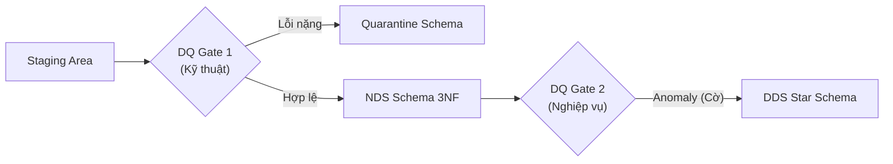
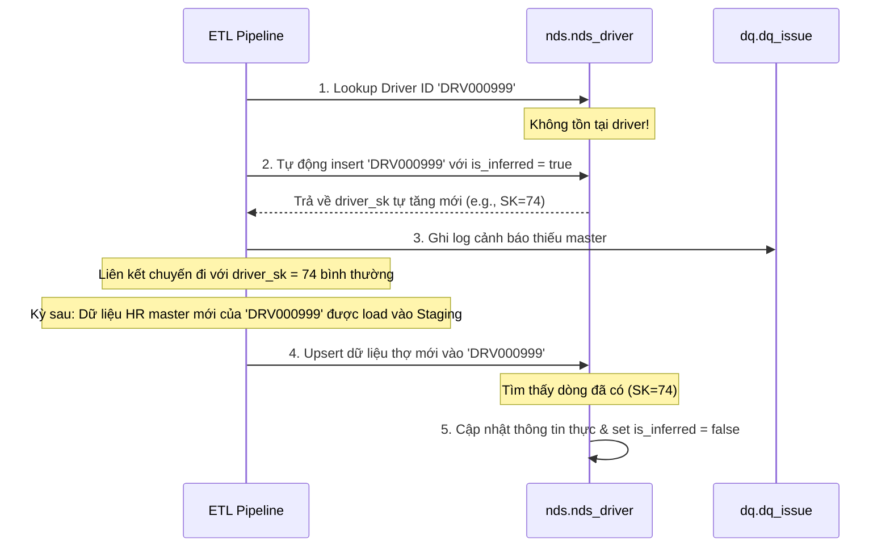

# Data Quality (DQ) & ETL Specification
**NYC Green Taxi Driver Operations BI - Warehouse Design Phase**

Tài liệu này đặc tả chi tiết bộ luật kiểm tra chất lượng dữ liệu (Data Quality Rules), cơ chế cách ly bản ghi lỗi (Quarantine), logic xử lý dữ liệu đến muộn (Late-Arriving Master), và chiến lược vận hành quy trình ETL để đảm bảo tính toàn vẹn và tin cậy cho kho dữ liệu.

---

## 1. Bộ luật Kiểm soát Chất lượng Dữ liệu (DQ Rules)

Dự án thiết lập **2 lớp chốt chặn DQ** độc lập để bảo vệ kho dữ liệu khỏi dữ liệu lỗi, đồng thời giữ lại tối đa thông tin cho báo cáo tài chính.



### 1.1 Lớp chốt chặn 1: DQ Gate 1 (Staging $\rightarrow$ NDS)
Tập trung vào kiểm tra kỹ thuật (Technical constraints), định dạng dữ liệu và các giá trị không thể bỏ trống (Null check).

| Mã luật (Rule Code) | Tên luật | Thuộc tính kiểm tra | Điều kiện hợp lệ | Mức độ (Severity) | Hành động khi vi phạm (Action) |
|---|---|---|---|---|---|
| `DQ_NULL_PK` | Khóa chính null | `driver_id`, `vehicle_id`, `shift_id`, `trip_key` | `NOT NULL` và không rỗng (`trim != ''`) | **ERROR** | Đẩy bản ghi vào **Quarantine**, ghi log `dq_issue`. Không nạp NDS. |
| `DQ_FORMAT_DRV`| Sai định dạng Driver ID| `driver_id` | Khớp regex `^DRV[0-9]{6}$` | **ERROR** | Đẩy bản ghi vào **Quarantine**, ghi log `dq_issue`. |
| `DQ_FORMAT_VEH`| Sai định dạng Vehicle ID| `vehicle_id` | Khớp regex `^VEH[0-9]{6}$` | **ERROR** | Đẩy bản ghi vào **Quarantine**, ghi log `dq_issue`. |
| `DQ_NEGATIVE_VAL`| Giá trị tài chính âm | `fare_amount`, `total_amount`, `trip_distance` | `>= 0.00` | **WARN** | Cho phép nạp NDS, ghi log `dq_issue` để báo cáo. |
| `DQ_DATE_ORDER`| Sai logic thời gian ca | `shift_start`, `shift_end` | `shift_end >= shift_start` | **ERROR** | Cách ly bản ghi ca làm việc (Quarantine). |
| `DQ_INVALID_ENUM`| Trạng thái không hợp lệ | `employment_status`, `vehicle_status` | Thuộc danh sách các giá trị được định nghĩa (enum) | **ERROR** | Đẩy bản ghi vào **Quarantine**, ghi log `dq_issue`. Không tự sửa thành `Unknown` và không nạp NDS. |

Giá trị `Unknown` chỉ được dùng cho **inferred member** khi natural key hợp lệ
nhưng master chưa đến. Nó không được dùng để che giấu một enum nguồn không hợp
lệ.

### 1.2 Lớp chốt chặn 2: DQ Gate 2 (NDS $\rightarrow$ DDS)
Tập trung vào kiểm tra tính hợp lý nghiệp vụ (Business Logic / Anomaly checks) và quan hệ thời gian chéo giữa các hệ thống.

| Mã luật (Rule Code) | Tên luật | Logic kiểm tra nghiệp vụ | Mức độ | Hành động khi vi phạm |
|---|---|---|---|---|
| `ANOM_DRV_OVERLAP`| Tài xế bị trùng ca làm | Một tài xế không được phép có hai ca làm việc (`nds_shift`) chồng lấn thời gian với nhau. | **WARN** | Vẫn nạp DDS nhưng đánh dấu `fact_driver_shift.is_anomaly = true` và log `dq_issue`. |
| `ANOM_VEH_OVERLAP`| Phương tiện bị trùng ca | Một xe không được phép gán cho 2 ca làm việc khác nhau tại cùng một thời điểm. | **WARN** | Nạp DDS, đánh dấu `fact_driver_shift.is_anomaly = true` và log `dq_issue`. |
| `ANOM_TRIP_OUT_SHF`| Chuyến đi ngoài ca | Một chuyến đi (`nds_trip`) được gán cho ca phải có thời gian đón/trả nằm trong khoảng thời gian của ca (`shift_start` và `shift_end`). | **WARN** | Nạp DDS, set `nds_trip.is_anomaly = true` để giữ lineage và lookup `dim_junk_trip.is_anomaly = true` cho `fact_driver_trip`. |
| `ANOM_DEL_NEGATIVE`| Độ trễ gán chuyến âm | Thời điểm gán chuyến (`assignment_timestamp`) không được phép diễn ra sau thời điểm đón khách (`pickup_datetime`). | **WARN** | Nạp DDS, set `assignment_delay_minutes = NULL` và log `dq_issue`. |

> [!NOTE]
> Với anomaly ở cấp chuyến đi, cờ `is_anomaly` được lưu ở `nds_trip` để phục vụ audit/lineage và được propagate sang DDS qua `dim_junk_trip.is_anomaly`. `fact_driver_trip` không cần cột boolean riêng vì fact đã tham chiếu `junk_trip_key` chứa trạng thái anomaly.

---

## 2. Quy trình Cách ly Dữ liệu lỗi (Quarantine Schema)

Khi một bản ghi vi phạm luật ở mức độ **ERROR**, nó sẽ bị cách ly ra khỏi luồng tích hợp chính:

1. **Ghi nhận vào Quarantine**: Dữ liệu thô của dòng vi phạm được giữ nguyên trong `dq.quarantine_record.raw_payload`, kèm `batch_id`, `release_id`, source identity và `error_rule_code`. Bảng quarantine riêng theo nguồn chỉ là lớp tương thích tùy chọn, không phải contract chính.
2. **Ghi log vào `dq.dq_issue`**: Hệ thống chèn 1 dòng log mô tả chi tiết: mã luật vi phạm, khóa tự nhiên của bản ghi, thông báo lỗi và payload JSON chứa các cột bị lỗi để phục vụ đối soát.
3. **Báo cáo và sửa lỗi**: DQ analytics dataset hiển thị issue và quarantine
   theo rule/severity/source/release. Nó không join trực tiếp vào business fact.

---

## 3. Đặc tả Xử lý Dữ liệu Master Đến muộn (Late-Arriving Master)

Trong thực tế vận hành taxi, dữ liệu ca làm hoặc chuyến đi có thể được đẩy vào DWH trước khi dữ liệu nhân sự (Driver) hoặc đội xe (Vehicle) được cập nhật (ví dụ: tài xế mới đăng ký ca chạy trước khi HR hoàn thiện hồ sơ trên MySQL). 

Dự án xử lý triệt để bằng kỹ thuật **Inferred Member (Skeleton Row)**:



### Thuật toán thực thi:
1. Khi chạy ETL nạp bảng `nds_shift` hoặc `nds_trip_assignment`, thực hiện lookup Natural Key (`driver_id` / `vehicle_id`) trong bảng master `nds.nds_driver` / `nds.nds_vehicle`.
2. Nếu **không tìm thấy**:
   - Thực hiện `INSERT` một bản ghi mới vào master table:
     - `driver_nk` = `driver_id` thô.
     - `vendor_sk` = lookup theo vendor_id thô (nếu không thấy, map với vendor 0 - Legacy Pool).
     - Tất cả các thuộc tính mô tả khác (tên, ngày sinh, trạng thái...) = `'Unknown'` hoặc `NULL`.
     - `is_inferred` = `true`.
   - Trả về khóa surrogate key (`driver_sk`) vừa tạo để nạp vào bảng transaction bình thường.
   - Ghi nhận 1 dòng log cảnh báo `WARN` vào `dq.dq_issue` với mã lỗi `DQ_MISSING_MASTER`.
3. Khi chạy batch ETL master ở kỳ tiếp theo:
   - Thực hiện câu lệnh **Upsert**:
     ```sql
     INSERT INTO nds.nds_driver (driver_nk, vendor_sk, display_name, employment_status, is_inferred, ...)
     VALUES ('DRV000999', 1, 'Nguyen Van A', 'ACTIVE', false, ...)
     ON CONFLICT (driver_nk) DO UPDATE 
     SET display_name = EXCLUDED.display_name,
         employment_status = EXCLUDED.employment_status,
         is_inferred = false, -- Gỡ bỏ cờ inferred
         updated_at = now();
     ```
   - Bản ghi được bổ sung đầy đủ thông tin mà không làm ảnh hưởng đến các khóa ngoại đã liên kết trước đó ở các bảng giao dịch.

---

## 4. Chiến lược Vận hành ETL (ETL Strategy)

### 4.1 Thứ tự nạp dữ liệu (Load Order)
Quy trình nạp dữ liệu phải tuân thủ nghiêm ngặt nguyên tắc **Nạp Dimension/Master trước, Fact/Transaction sau** để đảm bảo toàn vẹn khóa ngoại.

```text
[Bắt đầu Batch]
       │
       ▼
 1. Nạp Master Lookups ──► (nds_vendor, nds_location)
       │
       ▼
 2. Nạp Master Entities ──► (nds_driver, nds_vehicle)
       │
       ▼
 3. Nạp Transactions ──► (nds_shift, nds_trip, nds_trip_assignment)
       │
       ▼
 4. Nạp DDS Dimensions ──► (dim_vendor, dim_location, dim_driver, dim_vehicle, dim_junk_trip)
       │
       ▼
 5. Nạp DDS Facts ──► (fact_driver_trip, fact_driver_shift)
       │
       ▼
[Kết thúc Batch & Đối soát]
```

### 4.2 Thiết lập kiểm soát lỗi và Khả năng Rerun (Idempotency)
Để đảm bảo chạy lại batch lỗi an toàn mà không làm hỏng dữ liệu lịch sử hoặc nhân đôi dòng:

1. **Batch identity bất biến**:
   - Mỗi logical load có `batch_id` và `release_id`.
   - Batch `SUCCEEDED` không bị sửa hoặc xóa để chạy lại. Một lần chạy lại tạo
     `batch_id` mới nhưng dùng cùng source identity; reconciliation xác nhận kết
     quả nghiệp vụ không đổi.

2. **Work tables trước khi publish (thiết kế mục tiêu, chưa triển khai đầy đủ)**:
   - Dữ liệu NDS/DDS dự kiến được chuẩn bị trong temporary/work tables.
   - Chỉ sau khi DQ và reconciliation pass mới merge vào bảng đích trong một
     transaction ngắn.
   - Batch lỗi trước publish chỉ cần xóa work rows của chính batch đó, không
     đụng lịch sử đã commit.

3. **Facts upsert theo business key**:
   - `fact_driver_trip` có unique key theo `trip_id`.
   - `fact_driver_shift` có unique key theo `shift_id`.
   - Dùng `INSERT ... ON CONFLICT ... DO UPDATE` hoặc `MERGE` với payload
     deterministic. Không delete toàn bộ fact của batch đã thành công.

4. **SCD Type 2 theo change identity, không rollback thủ công**:
   - Mỗi phiên bản dimension có unique identity theo natural key và
     `start_date`, đồng thời lưu `source_event_id` hoặc `source_row_hash`.
   - Loader sắp xếp change events theo `effective_at`, khóa natural key cần xử
     lý và chỉ tạo version khi hash thuộc tính SCD thay đổi.
   - Cùng event/hash chạy lại phải trở thành no-op nhờ unique constraint.
   - Việc đóng dòng cũ và chèn dòng mới diễn ra trong cùng transaction. Không
     dùng `DELETE batch_id` rồi đoán dòng nào cần mở lại.

5. **Transaction boundary có kiểm soát (một phần đã triển khai)**:
   - Mỗi entity hoặc partition tháng được publish trong một transaction riêng
     để tránh transaction quá lớn với hàng triệu trips.
   - Chỉ cập nhật `audit.metadata_etl_batch` thành `SUCCEEDED` sau khi tất cả
     entity/partition hoàn tất và reconciliation pass.

6. **DQ audit idempotent theo source identity**:
   - Cùng `release_id`, source system, entity, source record và rule chỉ ghi một
     `dq_issue` hoặc quarantine record.
   - Rerun tạo `batch_id` mới nhưng không nhân đôi cùng một lỗi nguồn đã ghi
     nhận; lịch sử audit của batch thành công không bị xóa.
